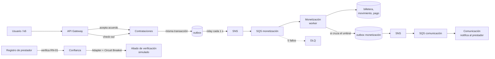

# Guía de las pruebas de carga y de fallos de JOBBI

Esta guía explica, paso a paso y sin dar nada por sabido, **qué hace cada prueba,
por qué el sistema falla (o no) y qué deberías ver en el tablero de Grafana**. Al
final de cada prueba hay una sección con lo que **realmente pasó** en las
ejecuciones del 24 de septiembre de 2026, para que puedas comparar.

Contenido:

1. [Conceptos mínimos](#1-conceptos-mínimos)
2. [El recorrido de un cobro, de punta a punta](#2-el-recorrido-de-un-cobro-de-punta-a-punta)
3. [Cómo preparar y reiniciar el entorno antes de cada prueba](#3-cómo-preparar-y-reiniciar-el-entorno-antes-de-cada-prueba)
4. [Cómo leer el tablero y las bitácoras](#4-cómo-leer-el-tablero-y-las-bitácoras)
5. [Qué hace la carga de fondo (k6)](#5-qué-hace-la-carga-de-fondo-k6)
6. [Pruebas de carga](#6-pruebas-de-carga): humo, nominal, pico, estrés y resistencia
7. [Pruebas de fallos](#7-pruebas-de-fallos): fallos 1 a 4
8. [Hallazgo: el gateway se satura cerca de 20 TPS](#8-hallazgo-el-gateway-se-satura-cerca-de-20-tps)
9. [Resumen: qué patrón se pone a prueba en cada experimento](#9-resumen-qué-patrón-se-pone-a-prueba-en-cada-experimento)

---

## 1. Conceptos mínimos

| Término | Qué es, en palabras simples |
|---|---|
| **Minikube** | Un clúster de Kubernetes completo corriendo dentro de tu computador (en un contenedor de Docker). Todo JOBBI vive ahí. |
| **Pod** | Un programa en ejecución dentro del clúster. Cada servicio de JOBBI es un Pod (por ejemplo, el Pod de Monetización). |
| **Deployment** | La "orden" que le dice a Kubernetes: *"quiero siempre 1 Pod de Monetización vivo"*. Si el Pod muere, Kubernetes crea otro solo. |
| **Servicio (microservicio)** | Cada parte del negocio es un programa aparte con su propia base de datos: Identidad, Mercado, Contrataciones, Monetización, Comunicación, Confianza, etc. |
| **API Gateway** | La única puerta de entrada. El navegador y las pruebas solo hablan con él, y él reparte las peticiones a cada servicio. |
| **Límite de recursos** | Cuánta CPU y memoria puede usar como máximo cada Pod. Monetización, por ejemplo, tiene **256 MiB** de memoria y **300m** de CPU (0,3 núcleos). Si se pasa de memoria, el sistema operativo lo mata (**OOMKilled**). Si se pasa de CPU, lo frena (*throttling*). |
| **PostgreSQL** | La base de datos. Hay una sola instancia con **9 bases separadas**, una por servicio. |
| **Evento** | Un mensaje que dice "algo pasó", por ejemplo `CONTRATACION_COMPLETADA`. Quien lo emite no sabe quién lo va a leer. |
| **SNS y SQS (LocalStack)** | El "correo" de los eventos. **SNS** es un tema al que se publica; **SQS** es una cola (buzón) de donde un servicio los lee. LocalStack imita los de Amazon, pero corre local y gratis. |
| **DLQ (Dead Letter Queue)** | Una cola aparte donde van a parar los mensajes que fallaron **5 veces** seguidas, para que alguien los revise. Lo ideal es que siempre tenga 0. |
| **Visibilidad (30 s)** | Cuando un servicio toma un mensaje de la cola, este queda "oculto" 30 s. Si el servicio no confirma que lo procesó, el mensaje reaparece y se vuelve a intentar. |
| **TPS** | *Transacciones por segundo.* En esta guía, **peticiones HTTP por segundo al gateway**. |
| **p50 / p95 / p99** | Percentiles de latencia. p95 = 400 ms significa que el 95 % de las peticiones tardó menos de 400 ms. El SLO del proyecto se mide con el **p95**. |
| **SLO** | La meta de servicio: p95 < 400 ms en el camino crítico, menos de 1 % de errores 5xx, 0 mensajes en la DLQ, etc. |
| **5xx / 503 / 409** | Códigos de respuesta HTTP. **5xx** = falló el servidor; **503** = "no disponible, intenta más tarde"; **409** = regla de negocio que no deja hacer algo (no es un error del servidor). |
| **k6** | La herramienta que simula usuarios y genera la carga. Corre como un Pod más dentro del clúster (un *Job*). |
| **Prometheus / Grafana** | Prometheus recoge números del sistema cada 5 s (latencias, colas, memoria…); Grafana los dibuja en el tablero. |

---

## 2. El recorrido de un cobro, de punta a punta

El caso de uso es: **registrar el pago en efectivo de una contratación completada
y aplicar la comisión pendiente sobre la billetera del prestador.** Casi todas
las pruebas lo perturban, así que conviene entenderlo primero.



Paso a paso:

0. **Antes de todo: el prestador se verifica al registrarse** (**RN-01**). Confianza consulta al **aliado externo** con su documento, a través de un **Adapter** (traduce el formato del aliado) y un **Circuit Breaker** (corta la llamada si el aliado anda mal). El prestador queda:
   - **APROBADA**: aparece en la búsqueda, muestra el sello de verificado y puede acordar servicios;
   - **RECHAZADA** (antecedentes con hallazgos, ~20 % de los documentos en el simulador): ni aparece ni trabaja;
   - **PENDIENTE** (el aliado no respondió): ni aparece ni trabaja hasta que un proceso de fondo lo verifique.

   El veredicto vale **30 días**. Después, ese mismo proceso lo renueva en segundo plano. **Ningún otro paso llama al aliado.**
1. **Aceptar el acuerdo** (demandante y prestador aceptan una tarifa). El gateway:
   - revisa que la billetera del prestador no esté bloqueada (**RN-04**);
   - revisa que el prestador esté **APROBADO**, leyendo el estado ya guardado (**RN-01**), sin llamar al aliado;
   - pide a Monetización el porcentaje del plan del prestador (Free 18 %, Pro 12 %, **Strategy**).

   Contrataciones crea la contratación con esa comisión **congelada** (**RN-05**).
2. **Check-in y check-out.** El ciclo de vida lo controla el patrón **State**: no se puede cerrar sin haber hecho check-in (**RN-02**). Al cerrar, Contrataciones guarda **en la misma transacción** el cambio de estado y el evento `CONTRATACION_COMPLETADA` en su tabla *outbox* (**Transactional Outbox**).
3. **Publicación.** Un hilo de fondo (**Polling Publisher**) revisa el outbox cada segundo y publica los eventos pendientes en SNS (**Publish-Subscribe**).
4. **Cobro.** El worker de Monetización lee la cola SQS. Primero revisa si ese evento ya lo procesó (**Idempotent Receiver**); si no, carga la comisión en la billetera, registra el pago en efectivo y guarda el evento como procesado, todo en una sola transacción (**Repository**).
5. **Bloqueo.** Si el saldo pendiente llega al umbral de **150.000 COP** (**Specification**, RN-04), la billetera se bloquea y sale el evento `BILLETERA_BLOQUEADA`, que Comunicación convierte en una notificación para el prestador.
6. **Si algo falla 5 veces** con un mismo mensaje, SQS lo aparta a la **DLQ**.

**Idea clave:** el check-out responde **sin esperar** el cobro. El cobro llega
unos milisegundos después por el evento. Por eso Monetización puede estar caída y
el prestador igual cierra su servicio: el cobro queda esperando en la cola.

---

## 3. Cómo preparar y reiniciar el entorno antes de cada prueba

### 3.1 Ventanas que conviene tener abiertas

```bash
# Terminal 1 · aplicación (http://localhost:3000)
kubectl port-forward svc/jobbi-frontend 3000:3000 -n aws-local
# Terminal 2 · gateway (lo usa la aplicación)
kubectl port-forward svc/api-gateway 8080:8080 -n aws-local
# Terminal 3 · Grafana (http://localhost:3001: abre en el índice de pruebas)
kubectl port-forward svc/grafana 3001:3000 -n monitoring
# Terminal 4 · aquí se lanzan las pruebas, UNA A LA VEZ
```

Si un `port-forward` se corta (el comando termina con error), vuelve a lanzarlo.

### 3.2 Reinicio entre pruebas (recomendado antes de cada una)

```bash
./scripts/reiniciar-entorno.sh
```

Qué hace, en orden:

1. **Retira cualquier fallo que haya quedado inyectado**: pone PostgreSQL en 1 réplica y deja al aliado de verificación respondiendo normal.
2. **Detiene las pruebas k6** que sigan corriendo en el clúster.
3. **Espera a que no queden eventos en vuelo** (outbox y colas vacías, hasta 90 s), para no perder cobros al reiniciar el broker.
4. **Reinicia LocalStack** (colas limpias) y **todos los servicios de dominio**. Los contadores en memoria, los hilos consumidores y el Circuit Breaker vuelven a su estado inicial.
5. **Comprueba** que los 9 servicios respondan y que los dos consumidores (Monetización y Comunicación) estén conectados a su cola.

Tarda entre 1 y 2 minutos y termina con `=== Entorno listo para la siguiente prueba ===`.

**No reinicia** el gateway ni el frontend (así no se cortan tus `port-forward`)
**ni Prometheus/Grafana**, que conservan la historia para comparar una prueba con
otra. Variantes:

| Comando | Cuándo usarlo |
|---|---|
| `./scripts/reiniciar-entorno.sh` | Entre prueba y prueba. Conserva los datos. |
| `./scripts/reiniciar-entorno.sh --datos` | Para empezar de cero: **borra todas las bases** (irreversible) y crea las 4 cuentas demo (`prestador1/2@demo.jobbi.co`, `demandante1/2@demo.jobbi.co`). |
| `./scripts/reiniciar-entorno.sh --todo` | Si también quieres reiniciar el gateway y el frontend. Corta los `port-forward` de las terminales 1 y 2. |
| `./scripts/reiniciar-entorno.sh --metricas` | Además **vacía el histórico de Prometheus**: las gráficas de Grafana arrancan vacías y solo muestran la prueba siguiente. Las mediciones anteriores se pierden (las bitácoras en `tests/` se conservan). |
| `./scripts/reiniciar-entorno.sh --datos --metricas` | **Todo en cero** antes de una prueba: gráficas vacías **y** contadores de negocio en 0 (billeteras bloqueadas, recaudo, saldo), con las 4 cuentas demo. |

**Por qué hay dos opciones.** Las **curvas** (tráfico, latencia, CPU…) son
mediciones guardadas en Prometheus: `--metricas` las borra. Los **contadores de
negocio** se calculan desde la base de datos: solo vuelven a 0 con `--datos`.

### 3.3 Reglas de oro

- **Una prueba a la vez**, con el reinicio entre medio. Si corren dos juntas, sus efectos se mezclan.
- **No interrumpas un script con Ctrl+C durante las esperas.** Aunque se vea quieto, está esperando a propósito. Ahora imprime `· faltan N s` y `· k6 sigue: …`. Lo último que hace es la **verificación de integridad**, que es la evidencia más importante. En las ejecuciones del 24 de septiembre, los fallos 1, 2 y 3 se interrumpieron antes de llegar a ella.
- Las pruebas crean cuentas **"K6 Prestador N"** y **"K6 Demandante"** que aparecen en la búsqueda del frontend. Para una demo limpia, termina con `./scripts/reiniciar-entorno.sh --datos`.

---

## 4. Cómo leer el tablero y las bitácoras

### 4.1 Un tablero por prueba

Grafana abre en **«0 · Índice de pruebas»**, con un enlace a cada tablero de la
carpeta **JOBBI · Pruebas (un tablero por prueba)**. Cada uno muestra **solo los
paneles de esa prueba** y, arriba, un recuadro con el comando, qué deberías ver y el
criterio de éxito. Ya traen su rango de tiempo (15 min; 3 h en resistencia) y se
refrescan cada 5 s. Abre el de la prueba que vas a correr **antes** de lanzarla.

Los paneles de infraestructura muestran **una curva por servicio** (`monetizacion`,
`gateway`…), no por Pod. Cada reinicio crea un Pod con otro nombre, y graficar por
Pod llenaría las gráficas de curvas viejas.

Los tableros se generan con `k8s/monitoring/grafana/generar_tableros.py`. Para
cambiarlos, se edita ese archivo y se aplica con
`python3 k8s/monitoring/grafana/generar_tableros.py && kubectl apply -k k8s/monitoring`.

### 4.2 El tablero general "JOBBI · Cobro de comisión en efectivo"

Reúne todos los paneles, en la carpeta **JOBBI**. Tiene **tres filas**:

| Fila | Qué agrupa | Paneles |
|---|---|---|
| **Negocio** (tabla 8.1.3) | Lo que le importa al negocio | *Tasa de recaudo de comisión en efectivo*, *Eventos en Dead Letter Queue*, *Tasa de contacto tras búsqueda (match rate)*, *Billeteras bloqueadas (RN-04)*, *Saldo pendiente total*, *Comisiones facturadas vs. cargadas en billetera*, *Eventos consumidos por resultado* |
| **Técnicas · RED + saturación** (tabla 8.1.2) | *Rate* (cuánto tráfico), *Errors* (cuántos fallan), *Duration* (cuánto tardan) y colas | *Rate · solicitudes por segundo*, *Errors · % de respuestas 5xx*, *Duration · latencia del gateway (p50/p95/p99)*, *Duration · p95 por endpoint del caso de uso*, *Latencia del cobro asíncrono*, *Saturación · backlog del outbox*, *Saturación · mensajes en colas SQS*, *Circuit Breaker · aliado de verificación*, *Llamadas al aliado por resultado*, *p95 · aceptar acuerdo* |
| **Infraestructura** (tabla 8.1.4) | Cómo están los servicios | *Uso de memoria por servicio*, *Memoria · % del límite*, *Uso de CPU por servicio*, *CPU · % del límite*, *Network I/O por servicio*, *Reinicios de contenedores*, *Contenedores terminados por OOMKilled*, *Pool de BD · conexiones en uso*, *PostgreSQL · conexiones vs. max_connections* |

Consejos de lectura:

- La **línea roja** en los paneles de latencia marca el SLO (400 ms); en el de errores, el 1 %.
- Los **huecos** en una curva significan "no hubo tráfico" (sin peticiones no hay latencia que medir) o "no se pudo medir" (por ejemplo, la base caída).
- Con poco tráfico, el **p99 salta mucho**: una sola petición lenta en un minuto lo dispara. Mira el **p95**.
- La latencia se mide hasta **60 s** (el tiempo máximo que espera k6). Si una curva queda pegada en 60 s, la latencia real es igual o mayor.
- El panel de **errores cuenta solo respuestas 5xx** (el servidor diciendo "fallé"). Un sistema saturado suele **responder tarde, no con error**: esas esperas no aparecen ahí, sino en la latencia y en el resumen de k6 (`http_req_failed` por tiempo agotado y `dropped_iterations`).

### 4.3 Las bitácoras

Cada experimento de fallos deja en `tests/caos/resultados/`:

- `<experimento>-<fecha>.log`: la línea de tiempo, con fotos de las métricas **ANTES / DURANTE / DESPUÉS** y la verificación de integridad.
- `<experimento>-<fecha>.log.k6.txt`: la salida completa de la carga de fondo.

Las pruebas de carga dejan su resumen en `tests/k6/resultados/<escenario>-<fecha>.json`.

**Cómo leer una "foto" de la bitácora.** Varias métricas se filtran para mostrar
solo lo que es mayor que cero. Por eso:

- `errores 5xx % por servicio  sin dato` quiere decir **0 % de errores** (no hay ninguno que mostrar).
- `pool BD en uso  sin dato` quiere decir que **ningún servicio tenía conexiones ocupadas** en ese instante.
- `p95 … nan` quiere decir que **en ese minuto no hubo peticiones** de ese tipo.

### 4.4 La verificación de integridad

Al final de cada experimento corre `scripts/caos/verificar-integridad.sh`, que
revisa directamente en la base que **el dinero cuadre**. Las seis condiciones
deben dar **0**:

| Comprobación | Qué significaría un número distinto de 0 |
|---|---|
| Cobros dobles | Una contratación con dos cargos de comisión (falló la idempotencia) |
| Pagos dobles | Un pago en efectivo registrado dos veces |
| Saldo descuadrado | El saldo de una billetera no es la suma de sus movimientos |
| Comisiones perdidas | Una contratación completada en efectivo que, 2 minutos después, sigue sin su cargo |
| Eventos pendientes en outbox | Eventos que nunca salieron hacia SNS |
| Mensajes en las DLQ | Cobros o avisos que fallaron 5 veces y quedaron apartados |

Se puede correr sola en cualquier momento, es de solo lectura:
`./scripts/caos/verificar-integridad.sh`.

---

## 5. Qué hace la carga de fondo (k6)

Todas las pruebas de carga, y los fallos (como "tráfico de fondo"), usan el mismo
guion, que imita a usuarios reales usando la aplicación por el gateway:

1. **Preparación (una vez):** crea un oficio ("Plomería") y **5 prestadores APROBADOS** con su tarifa publicada. Como ~20 % de los registros sale rechazado por el aliado, registra los que haga falta hasta tener 5 aprobados (`prestadores_no_aprobados` cuenta los descartados).
2. **Cada usuario virtual (VU)** se registra como demandante y abre un chat con uno de esos prestadores.
3. **Cada iteración es un servicio completo:**
   `proponer tarifa → aceptar (con verificación RN-01) → check-in → check-out → calificar → abrir un chat nuevo`.
   En una muestra de iteraciones (30 % en nominal, 10 % en las demás), el usuario además consulta cada 0,2 s si ya se cobró, para medir **cuánto tarda el cobro asíncrono** (`pubsub_latencia_cobro_ms`).
4. **Prestadores bloqueados.** Como cada servicio le suma ~7.000 a 21.000 COP de comisión, un prestador llega al umbral de 150.000 tras unos 10 servicios y el gateway le rechaza acuerdos nuevos con **409**. El guion hace lo que haría el mercado real: registra otro prestador y sigue (`prestadores_bloqueados_reemplazados`). Ese 409 **no cuenta como error**. Cada registro nuevo pasa por la verificación con el aliado: **es así como el aliado recibe tráfico durante las pruebas**. Si el prestador nuevo sale rechazado o pendiente, se descarta y se intenta otro.
5. **Servicios a medias.** Si con el sistema saturado una petición se agota a mitad del servicio, ese servicio queda abierto y JOBBI (con razón) no deja acordar otro con la misma persona: *"el servicio anterior sigue abierto"* (409). El usuario virtual hace lo que haría una persona: **abandona y vuelve a empezar** con un registro y un contacto nuevos (`servicios_dejados_a_medias`). Sin esto, en la prueba de estrés del 24-sep ~280 usuarios virtuales quedaron atascados repitiendo ese 409 sin generar carga real.
6. **Al final:** espera hasta 2 minutos y comprueba, prestador por prestador, que **la comisión producida en Contrataciones sea igual a la cobrada en Monetización** (`pubsub_consistencia_final`, debe ser 100 %).

**Cuánta carga es "X TPS".** Cada iteración hace unas 6 peticiones, así que k6
lanza `TPS ÷ 6` servicios por segundo: 12 TPS son ~2 servicios completos por
segundo. La **tasa de llegada es fija**: si el sistema se atrasa, k6 no espera y
deja constancia en `dropped_iterations` (iteraciones que no pudo lanzar).

---

## 6. Pruebas de carga

### 6.0 Humo (preparación)

| | |
|---|---|
| **Comando** | `./scripts/k6-en-cluster.sh humo` |
| **Caso del documento** | Ninguno: es una comprobación previa. |
| **Qué hace** | 1 usuario hace 3 servicios completos. |
| **Duración** | ~1 min (+1 min la primera vez, mientras Minikube descarga la imagen de k6). |

**Para qué sirve:** confirmar que todo el camino funciona dentro del clúster antes
de cargar. Si el humo falla, no tiene sentido seguir.

**Qué ver:** en la terminal, `✓` en todos los *checks* y `consistencia` en 100 %.
En Grafana (tablero *1 · Humo*), un pequeño pulso en *Rate · solicitudes por segundo*.

**Resultado del 24-sep:** 47 peticiones, 0 % de errores, p95 del check-out 29 ms, consistencia 100 %. ✅

---

### 6.1 Nominal — 12 TPS durante 5 minutos

| | |
|---|---|
| **Comando** | `./scripts/k6-en-cluster.sh nominal` |
| **Caso del documento** | **Punto 10.4 · Escenario 1 Nominal**: tráfico representativo (~12 TPS). Aceptación: p95 < 300 ms y errores < 1 %. |
| **Duración** | ~7 min (5 de carga + preparación y verificación). |
| **Patrones en juego** | Todos los del camino del cobro: Gateway (3), Comunicación híbrida (4), Transactional Outbox (5), Adapter y Circuit Breaker (6, 7), Publish-Subscribe (8), Idempotent Receiver (9), Polling Publisher (10), Repository (12), Strategy (13), State (14), Specification (15). |

**Por qué se hace:** es la "foto sana" del sistema. Demuestra que con la carga
esperada se cumplen las metas y sirve de **línea base** para comparar todo lo demás.

**Qué NO debería fallar:** nada. Es la prueba que tiene que pasar.

**Cómo debería comportarse:** respuestas rápidas, el cobro llega en milisegundos,
las colas nunca se acumulan, las billeteras de los prestadores de prueba se van
bloqueando (y se reemplazan) y el dinero cuadra.

**Qué ver en Grafana** — tablero *2 · Nominal · 12 TPS*:

| Panel | Qué deberías ver |
|---|---|
| RED → *Rate · solicitudes por segundo* | Una meseta estable en **~12 req/s** |
| RED → *Duration · latencia del gateway* | **p95 muy por debajo** de la línea roja de 400 ms |
| RED → *Errors · % de respuestas 5xx* | 0 % |
| RED → *Latencia del cobro asíncrono* | Decenas de milisegundos |
| RED → *Saturación · mensajes en colas SQS* | Prácticamente en 0 (los mensajes salen tan rápido como entran) |
| Negocio → *Tasa de recaudo* | ~100 % (puede bajar un poco un instante mientras un cobro viaja) |
| Negocio → *Billeteras bloqueadas (RN-04)* | Sube poco a poco (prestadores de prueba que llegan al umbral) |
| Infra → *CPU · % del límite* | Todos los Pods por debajo del 80 % |

**Criterio de éxito (lo evalúa k6 solo):** `✓` en los umbrales
`http_req_failed < 1 %`, `p95 checkout < 300 ms`, `pubsub_latencia_cobro p95 < 5 s`,
`pubsub_cobro_a_tiempo > 99 %` y `pubsub_consistencia_final = 100 %`. El script
termina con `=== k6 terminó: umbrales cumplidos ===`.

**Resultado del 24-sep:** tres ejecuciones a 12-13 req/s con **0 % de errores, p95
del check-out entre 14 y 47 ms y consistencia del 100 %**. Todos los umbrales se
cumplieron. ✅

---

### 6.2 Pico — ráfaga de 50 TPS

| | |
|---|---|
| **Comando** | `./scripts/k6-en-cluster.sh pico50` |
| **Caso del documento** | **Punto 10.4 · Escenario 2 Pico** (~50 TPS). Aceptación: procesamiento consistente **sin degradación financiera**. |
| **Duración** | ~7 min: 1 min a 12 TPS → **2 min a 50 TPS** → 1 min a 12 TPS, más preparación y verificación. |
| **Patrones en juego** | Los mismos del nominal. Destacan el **desacople por eventos** (Pub/Sub + Outbox): el check-out no espera el cobro, así que una ráfaga no bloquea a quien cierra el servicio; la cola absorbe la diferencia. |

**Por qué se hace:** para ver si el sistema aguanta una avalancha repentina y,
sobre todo, si **se recupera solo** cuando pasa.

**Qué va a "fallar" y por qué:** según lo medido (sección 8), **por encima de ~20
TPS el gateway se queda sin CPU**. A 50 TPS lo esperable es que:

- la latencia suba mucho (p95 de varios segundos);
- k6 no alcance a lanzar todas las iteraciones (`dropped_iterations` > 0);
- algunos umbrales de tiempo salgan en `✗`.

**Cómo debería comportarse igual:** **sin degradación financiera**. Aunque todo
vaya lento, **ningún cobro se pierde ni se duplica**: `pubsub_consistencia_final`
en 100 % y DLQ en 0. Al volver a 12 TPS, la latencia debe regresar a la línea base.

**Qué ver en Grafana** — tablero *3 · Pico · ráfaga de 50 TPS*:

| Panel | Qué deberías ver |
|---|---|
| RED → *Rate* | Escalón de 12 a lo que el sistema alcance (menos de 50 si está saturado) y regreso a 12 |
| RED → *Duration · latencia del gateway* | El p95 cruza la línea roja durante la ráfaga y vuelve a bajar |
| Infra → *CPU · % del límite* | **El gateway cerca del 100 %** durante la ráfaga |
| RED → *Saturación · mensajes en colas SQS* | Puede subir un poco y se drena |
| Negocio → *Comisiones facturadas vs. cargadas* | Las dos curvas terminan juntas |

**Criterio de éxito para el documento:** consistencia 100 % y DLQ = 0, aunque la
latencia no cumpla. Documenta hasta cuánto tráfico real llegó (*Rate*) y cuánto
tardó en volver a la normalidad.

**Resultado del 24-sep:** la ejecución no dejó resumen (se interrumpió el
seguimiento). Hay que repetirla.

---

### 6.3 Estrés y punto de quiebre — 75 → 125 → 250 → 350 TPS

| | |
|---|---|
| **Comando** | `./scripts/caos/estres-punto-de-quiebre.sh` |
| **Caso del documento** | **Punto 10.4 · Escenario 3 Estrés** (3x → 5x → 10x el pico, más de 250 TPS) y **Rúbrica, Punto 3: prueba de estrés de punto de quiebre**. |
| **Duración** | ~16 min: 4 escalones de 2,5 min cada uno + 2,5 min de vuelta a 12 TPS + verificación. |
| **Patrones en juego** | Todos. Esta prueba pone en evidencia la **contraindicación del patrón 3 (Gateway)**, reconocida en el catálogo: *"es un punto único que exige diseño pensado en alta disponibilidad"*. |

**Por qué se hace:** no se busca "pasar", sino **romper el sistema a propósito**
para saber **dónde se rompe primero** y **si se recupera**.

**Qué va a fallar y por qué:** la tasa pedida supera de lejos lo que el sistema
atiende. El primer recurso en saturarse marca el punto de quiebre. Los candidatos:

1. **CPU del gateway** (límite de 500m), que según lo medido es el primero (sección 8).
2. **CPU de los servicios** (límite de 300m cada uno).
3. **Pool de conexiones a la base.** Cada servicio puede abrir 5 conexiones fijas + 10 de desborde (15), y con 10 servicios son 150 frente a las **100** que admite PostgreSQL. Si se agotan, las peticiones esperan y a los 30 s responden **503**.
4. **La propia tasa de llegada**: k6 descarta iteraciones (`dropped_iterations`).

**Cómo debería comportarse:** degradarse (lento, algunos 503), pero **sin
perder ni duplicar dinero**, y **volver solo a la normalidad** en el último
escalón de 12 TPS.

**Qué ver en Grafana** — tablero *8 · Estrés · punto de quiebre 75 → 350 TPS* (en cada escalón):

| Panel | Qué deberías ver |
|---|---|
| RED → *Rate* | Escalones que suben y se "aplanan" en el máximo que el sistema alcanza |
| Infra → *CPU · % del límite* | Qué Pod llega primero a ~100 % (se espera el gateway) |
| Infra → *Pool de BD* y *PostgreSQL · conexiones* | Si alguna curva toca su tope |
| RED → *Duration · latencia del gateway* y *Errors · %* | El p95 muy por encima de la línea roja; los 5xx si aparecen |
| Infra → *Reinicios de contenedores* | Si algún Pod se reinicia por la carga |

**Qué anotar para el informe:** a qué TPS real (*Rate*) empezó la degradación,
qué recurso se saturó primero, qué error apareció y cuánto tardó en recuperarse al
volver a 12 TPS. El script toma una foto de las métricas al final de cada escalón.

**Cuidado:** si el gateway se reinicia por la carga, se cortan tus `port-forward`
de las terminales 1 y 2. Vuelve a lanzarlos.

**Por qué casi no hay errores 5xx aunque el sistema esté saturado:** el gateway
no falla, **responde tarde**. Las peticiones esperan en fila y terminan con 200/201;
las que el cliente deja de esperar se cuentan en k6 (`http_req_failed`), no en el
servidor. Los 409 tampoco son errores del servidor: son reglas de negocio.

**Resultado del 24-sep (21:56-22:09, completo, con la versión anterior del script
de carga):**

| Escalón pedido | Tráfico real atendido | p95 del gateway | 5xx | Conexiones PostgreSQL |
|---|---|---|---|---|
| Reposo | 0 req/s | — | 0 | 18 / 100 |
| 75 TPS | **29,4 req/s** | ≥ 10 s (techo de la medición de entonces) | 0 | 31 / 100 |
| 125 TPS | 18,8 req/s | ≥ 10 s | 0,19 % (gateway) | 33 / 100 |
| 250 TPS | 28,2 req/s | ≥ 10 s | 0 | 36 / 100 |
| 350 TPS | 24,7 req/s | ≥ 10 s | 0 | 37 / 100 |
| Vuelta a 12 TPS | — | **0,049 s** (recuperado) | 0 | 37 / 100 |

- **Punto de quiebre: la CPU del gateway**, al 100 % de su límite desde el primer escalón. El sistema no atendió más de **~25-40 req/s**, pidiera lo que pidiera. PostgreSQL (máximo 37 de 100 conexiones), el pool y los demás servicios quedaron sobrados.
- **Recuperación:** al volver a 12 TPS, el p95 bajó a 49 ms sin intervención y sin reinicios de Pods.
- **Resumen de k6:** 18.119 peticiones (24 req/s de promedio), **12.141 iteraciones descartadas** (el sistema no daba abasto), 3,98 % de peticiones fallidas del lado del cliente, p95 del cobro asíncrono de 33 s.
- **Integridad OK** y **consistencia del dinero 100 %**: aun saturado, no se perdió ni se duplicó un solo cobro.
- **Defecto del script de carga detectado en esta corrida (ya corregido):** ~280 usuarios virtuales quedaron atascados repitiendo un 409 (4.801 en 15 min) porque sus servicios se quedaron a medias. Ocupaban cupos de k6 sin generar carga real. Ahora abandonan y vuelven a empezar (sección 5). Conviene **repetir la prueba** para medir sin ese ruido y con la latencia visible hasta 60 s.

---

### 6.4 Resistencia — 12 TPS durante 1 a 2 horas

| | |
|---|---|
| **Comando** | `./scripts/k6-en-cluster.sh resistencia DURACION=1h` (o `DURACION=2h`) |
| **Caso del documento** | **Punto 10.4 · Escenario 4 Resistencia**: sin fugas de memoria ni acumulación de conexiones huérfanas. |
| **Duración** | 1 o 2 horas, más ~3 min. |

**Por qué se hace:** hay defectos que solo aparecen con el tiempo. Por ejemplo, un
programa que "olvida" liberar memoria crece un poco con cada petición y, horas
después, lo mata el límite. La carga es la nominal: lo que se mide es la
**estabilidad**, no la velocidad.

**Cómo debería comportarse:** igual que en el nominal, durante toda la hora.

**Qué ver en Grafana** — tablero *9 · Resistencia · 12 TPS durante 1-2 h* (ya viene con el rango de 3 horas):

| Panel | Sano | Señal de problema |
|---|---|---|
| Infra → *Uso de memoria por servicio* | Curva **plana** o en "dientes de sierra" (sube y baja) | Una rampa que **sube sin parar** (fuga) |
| Infra → *Pool de BD* / *PostgreSQL · conexiones* | Estable | Crece y no baja (conexiones huérfanas) |
| Infra → *Reinicios de contenedores* | Sin cambios | Cualquier aumento |
| RED → *Duration* | p95 estable | Tendencia a subir con el tiempo |

**Resultado del 24-sep:** no se ejecutó todavía.

---

## 7. Pruebas de fallos

Las cuatro siguen el mismo guion: **carga nominal de fondo** (12 TPS, para que haya
tráfico real) → foto ANTES → **inyección del fallo** → foto DURANTE → **restauración**
→ foto DESPUÉS → **verificación de integridad**. Si interrumpes el script con
Ctrl+C, igual restaura lo que inyectó.

### 7.1 Fallo 1 · Red: el aliado externo se pone lento y luego falla

| | |
|---|---|
| **Comando** | `./scripts/caos/fallo1-dependencia-externa.sh` |
| **Caso del documento** | **Punto 11 · Fallo 1 (Red / dependencia externa)**: retardo de 8.000 ms y respuesta 504 en la dependencia externa de verificación. Valida que el Circuit Breaker se abra y proteja las transacciones de pago en efectivo y las contrataciones del marketplace. |
| **Duración** | ~11 min. |
| **Patrones puestos a prueba** | **Circuit Breaker (7)** y **Adapter / Anti-Corruption Layer (6)**. También la **Comunicación híbrida (4)**: la verificación es la única llamada síncrona a un tercero en todo el sistema. |

**Qué papel juega el tercero.** El **aliado de verificación** (un simulador tipo
Truora) confirma la identidad y los antecedentes de un prestador (**RN-01**). Se
le consulta **solo al registrarse el prestador** y, pasados 30 días, para renovar
el veredicto. Nada más lo llama: ni la búsqueda, ni los acuerdos, ni el check-out,
ni el cobro. Su respuesta deja al prestador en uno de tres estados:

| Estado | Cuándo | ¿Aparece en búsquedas? | ¿Puede acordar servicios? | Sello "verificado" |
|---|---|---|---|---|
| **APROBADA** | El aliado aprobó identidad y antecedentes | ✅ | ✅ | ✅ |
| **RECHAZADA** | El aliado encontró antecedentes (~20 % en el simulador) | ❌ | ❌ | ❌ |
| **PENDIENTE** | **El aliado estaba caído o lento** al registrarse | ❌ | ❌ | ❌ |

El simulador decide el veredicto con un cálculo sobre el número de documento:
parece aleatorio, pero **el mismo documento siempre da el mismo resultado**, así
una prueba se puede repetir.

**Qué pasa si el aliado se cae:**

- **Prestadores ya aprobados:** **no se enteran**. Siguen apareciendo, acordando y cobrando. Si su veredicto vence durante la caída, **conservan su estado** hasta que se pueda renovar (una caída del tercero no castiga a quien ya estaba aprobado).
- **Prestadores que se registran durante la caída:** el registro **termina igual** (no falla ni se cuelga) y quedan **PENDIENTE**: no aparecen ni trabajan todavía.
- **Cuando el aliado vuelve:** un proceso de fondo en Confianza (el **reverificador**, cada 15 s) consulta a los PENDIENTE y los pasa a APROBADA o RECHAZADA. **Nadie tiene que intervenir.**
- **Demandantes, check-out, cobros y billeteras:** sin cambios.

**Cómo se ven afectados los registros, con el Circuit Breaker:**

1. Confianza espera **como máximo 2 s** la respuesta del aliado.
2. Los **3 primeros registros** durante el fallo esperan esos 2 s y quedan PENDIENTE.
3. Tras 3 fallos seguidos el circuito se **ABRE**: durante 30 s Confianza **ni llama** al aliado y los registros terminan **al instante** como PENDIENTE.
4. Cada 30 s queda **SEMIABIERTO** y deja pasar **una** llamada de prueba (la del reverificador o la de un registro). Si falla, se vuelve a abrir; si sale bien, se **CIERRA**.

**Por qué fallaría sin el patrón:** cada registro de prestador esperaría los 8 s
del aliado. Esos registros se acumularían en el gateway, cuya CPU ya es el cuello
de botella del sistema (sección 8), y **arrastrarían también a los acuerdos, los
check-out y los cobros** que pasan por el mismo gateway.

**Qué hace el script:**

| Minuto | Qué pasa |
|---|---|
| 0:00 | Carga nominal de fondo. k6 registra un prestador nuevo cada pocos segundos (reemplazos por RN-04): ese es el tráfico hacia el aliado |
| 1:00 | **El aliado responde con 8 s de retraso** (2 min) |
| 3:00 | **El aliado responde 504** de inmediato (1,5 min) |
| 4:30 | **El aliado se apaga** (su Pod pasa a 0 réplicas, 1 min): la caída total |
| 5:30 | El aliado vuelve, sin fallos |
| 6:15 | Cuenta cuántos prestadores se registraron durante el experimento y en qué estado quedaron |
| 7:00 | Vuelve a contar: **no debería quedar ningún PENDIENTE** |
| ~9:00 | Termina la carga y se verifica la integridad |

**Tres formas de fallar, tres efectos distintos en el tablero:**

| Fase | ¿El Pod del aliado sigue vivo? | CPU y memoria del aliado | Cómo falla la llamada |
|---|---|---|---|
| Retardo de 8 s | Sí | **Casi sin cambios**: esperar no consume CPU | Confianza corta a los 2 s (timeout) |
| 504 | Sí | **Casi sin cambios** | Error inmediato |
| **Apagado** | **No** | **Las curvas se cortan** y sus *Pods disponibles* caen a **0** | Conexión rechazada, inmediata |

Por eso, en las dos primeras fases el fallo **se ve en los paneles del circuito,
no en los de infraestructura**. Solo el apagado se ve en CPU, memoria y Pods.

**Qué ver en Grafana** — tablero *4 · Fallo 1 · Red: aliado externo lento y en 504*:

| Panel | Qué deberías ver |
|---|---|
| **Circuit Breaker · aliado de verificación** | **CERRADO → ABIERTO** a los pocos segundos de la inyección; parpadeos SEMIABIERTO cada 30 s; **CERRADO** al final |
| **Llamadas al aliado por resultado** | Durante el fallo, `fallo` y luego sobre todo `rechazada_por_circuito`; al final vuelve `exito` |
| **Prestadores por estado de verificación** | Sube la curva **PENDIENTE** durante el fallo y **baja a 0** tras la recuperación, mientras suben APROBADA y RECHAZADA |
| **p95 · registro de usuarios** | Un salto corto (las esperas de 2 s antes de que el circuito se abra) y vuelta a valores bajos mientras está abierto |
| **Uso de CPU / memoria por servicio** (aliado, Confianza, gateway) | En el apagado, la curva de **verificacion-externa se corta** y vuelve (desde cero) al encenderse. Confianza y el gateway **no suben**: el circuito evita que se queden esperando |
| **Pods disponibles · aliado, Confianza y gateway** | **verificacion-externa cae a 0** durante el apagado y vuelve a 1; Confianza y el gateway siguen en 1 todo el tiempo |
| **p95 · check-out** | **Sin cambios**: el cobro no depende del aliado |
| *Network I/O por servicio* | La línea **rx de verificacion-externa** (lo que le llega) cae casi a 0 con el circuito abierto. La línea tx la domina Prometheus leyendo métricas: no te fijes en ella |

**Criterio de éxito:** el circuito se abre y se cierra solo, los registros no se
cuelgan, **los PENDIENTE se resuelven solos** al volver el aliado y la integridad
da OK.

**Resultado del 24-sep:** esa corrida fue con un diseño anterior, que consultaba al
aliado al **aceptar cada acuerdo**. Confirmó el mecanismo del circuito: con el
aliado a 8 s, el p95 de "aceptar" subió a 3,48 s mientras el circuito se abría y
bajó a 0,040 s con el circuito abierto. Con el diseño actual hay que repetirla.

---

### 7.2 Fallo 2 · Servicios: se elimina el Pod de Monetización mientras cobra

| | |
|---|---|
| **Comando** | `./scripts/caos/fallo2-eliminar-pod-monetizacion.sh` (o con `--forzado`) |
| **Caso del documento** | **Punto 11 · Fallo 2 (Servicios / eliminación de Pod e idempotencia)**: `kubectl delete pod` de Monetización mientras procesa eventos. Valida la autorrecuperación y que el Idempotent Receiver impida un doble débito (RN-04). |
| **Duración** | ~8 min. |
| **Patrones puestos a prueba** | **Idempotent Receiver (9)**, **Publish-Subscribe (8)** (entrega "al menos una vez") y **DLQ (11)** (no debería usarse). La autorrecuperación la da el **Deployment** de Kubernetes (infraestructura, no es uno de los 15 patrones). |

**Contexto.** Monetización es quien cobra. Lee mensajes de la cola en lotes de
hasta 10 y, por cada uno, carga la comisión y **después** le confirma a la cola
que ya lo procesó, para que la cola lo borre.

**Línea de tiempo:** a 1:00 se borra el Pod de Monetización; a 2:30 se borra otra
vez el Pod nuevo. Con `--forzado`, el borrado es abrupto, como un corte de luz;
sin él, Kubernetes le pide que se apague ordenadamente.

**Qué falla y por qué:** el Pod desaparece mientras tiene mensajes "en la mano".
Hay tres casos posibles con cada mensaje:

| Estado del mensaje cuando muere el Pod | Qué pasa después |
|---|---|
| Aún en la cola | Nada: el Pod nuevo lo toma normalmente |
| Tomado pero **no cobrado** | Estaba oculto; a los **30 s** reaparece en la cola y el Pod nuevo lo cobra. **No se pierde.** |
| **Cobrado** pero sin confirmar a la cola | Reaparece y llega **otra vez**. El Pod nuevo ve que ese evento ya está registrado como procesado y lo **descarta** (`DUPLICADO`). **No se cobra dos veces.** |

Mientras no hay Pod, los eventos se acumulan en la cola: el cobro se atrasa, pero
no se pierde. El check-out sigue funcionando (no espera el cobro).

**Efectos colaterales esperables** durante los ~10 s sin Pod: el gateway no puede
consultar la billetera ni los planes. Para esos casos está diseñado para **dejar
pasar** los acuerdos y aplicar la tarifa del plan Free (18 %), de modo que nunca
se cobre de menos.

**Qué ver en Grafana** — tablero *5 · Fallo 2 · Servicios: se elimina el Pod de Monetización*:

| Panel | Qué deberías ver |
|---|---|
| RED → *Saturación · mensajes en colas SQS* | La cola de monetización **sube** mientras no hay Pod y **se drena** cuando llega el nuevo |
| Negocio → **Eventos consumidos por resultado** | Aparece la serie **`DUPLICADO`** tras cada eliminación (duplicados descartados) |
| Negocio → *Eventos en Dead Letter Queue* | **0** todo el tiempo |
| RED → *Latencia del cobro asíncrono* | Un pico (los cobros que esperaron) y vuelta a la normalidad |
| Infra → *Pods disponibles de Monetización* | Cae a **0** al eliminar el Pod y vuelve a **1** cuando el reemplazo está listo (dos veces) |

**Criterio de éxito:** Pod de reemplazo listo en segundos, integridad con **0
cobros dobles y 0 comisiones perdidas**, DLQ = 0.

**Resultado del 24-sep (parcial, se interrumpió antes de la verificación):** el
Pod de reemplazo quedó listo en **12 s** y **11 s**. La carga de esa corrida
terminó con **consistencia del 100 %** (lo producido = lo cobrado). La corrida se
hizo a 30 TPS y la saturación del gateway (sección 8) llevó el p95 de "aceptar"
a 5-10 s **antes incluso** de borrar el Pod. Por eso el script ahora usa 12 TPS:
así el efecto del fallo no se confunde con el de la saturación. Hay que repetirla.

---

### 7.3 Fallo 3 · Base de datos saturada: auto-escalado en caliente

| | |
|---|---|
| **Comando** | `./scripts/caos/fallo3-saturacion-bd.sh` |
| **Caso del documento** | **Punto 11 · Fallo 3 (Base de datos)**: saturar temporalmente la capacidad de Aurora Serverless v2 valida el auto-escalado. |
| **Duración** | ~11 min. |
| **Requisito** | El escalador desplegado (`deploy-backend.sh` ya lo hace; a mano: `kubectl apply -f k8s/escalador-bd.yaml`). |

**Qué es y por qué es una simulación.** Aurora Serverless v2 sube y baja la
capacidad de la base (en ACU: CPU y memoria) sin cortar conexiones, según la
carga. LocalStack no emula eso, así que JOBBI trae su propio **escalador**
(`services/escalador_bd/`, Deployment `escalador-bd`) que hace lo mismo con el
PostgreSQL del clúster:

1. Cada 5 s lee en Prometheus la CPU y la memoria que usa PostgreSQL.
2. Si la CPU usada pasa del **75 %** de la asignada durante 10 s (o la memoria
   del 85 %), **sube un nivel**; espera 15 s entre subidas para ver el efecto.
3. Si lo que usa cabría holgado en el nivel inferior (≤ 50 % de su CPU y ≤ 80 %
   de su memoria) durante 30 s, **baja un nivel**.
4. Aplica el nivel con el **redimensionamiento en caliente de Kubernetes**
   (`pods/resize`): el contenedor recibe más o menos CPU y memoria **sin
   reiniciarse**. También ajusta `work_mem` con `ALTER SYSTEM` para que
   PostgreSQL use la memoria nueva.

| Nivel | CPU asignada | Memoria asignada | work_mem |
|---|---|---|---|
| **0,5 ACU** (normal) | 0,5 núcleos | 640 Mi | 4 MB |
| 1 ACU | 1 núcleo | 1 Gi | 8 MB |
| 2 ACU | 2 núcleos | 1,5 Gi | 16 MB |
| 4 ACU (máximo) | 4 núcleos | 2 Gi | 32 MB |

Lo que **no** replica: Aurora escala en pasos de 0,5 ACU y ajusta su caché de
páginas; aquí los niveles doblan la capacidad y solo cambia `work_mem`. Si el
Pod de PostgreSQL se reinicia, vuelve a 0,5 ACU (la plantilla del StatefulSet)
y el escalador lo retoma desde ahí.

**Qué hace el script:**

1. Carga nominal de fondo (12 TPS) durante 11 min; foto ANTES en 0,5 ACU.
2. **Saturación moderada** (1:00): un Job con `pgbench` pide ~0,6 núcleos (1 transacción/s que ordena ~200 000 filas, ~0,6 núcleos·s cada una, sin tocar tablas del negocio).
3. **Pico** (3:30): ~2,4 núcleos (4 transacciones/s).
4. **Fin de la saturación** (6:00): se borra el Job y se espera a que la capacidad baje.
5. Escribe en la bitácora el historial de escalados (hora, nivel, motivo y uso), compara los reinicios de PostgreSQL y verifica la integridad.

**Cómo debería comportarse:**

| Momento | Capacidad | Qué pasa |
|---|---|---|
| Antes | 0,5 ACU | CPU usada ~0,01 núcleos |
| Saturación moderada | 0,5 → **1 ACU** | La CPU usada toca el límite de 0,5, el throttling sube, a los ~10 s sube a 1 ACU y la CPU queda en ~60 % de la asignada |
| Pico | 1 → **2 → 4 ACU** | Dos escalones seguidos (~15 s entre ellos) hasta que la CPU queda por debajo del 75 % |
| Fin de la saturación | 4 → 2 → 1 → **0,5 ACU** | Baja un escalón cada ~35 s: la base vuelve sola a su consumo normal |
| Todo el tiempo | — | **0 reinicios** de PostgreSQL; el check-out puede ponerse lento mientras la base está frenada y se recupera al subir la capacidad |

**Qué ver en Grafana**, tablero *6 · Fallo 3 · Base de datos saturada* (se
actualiza cada 5 s; las marcas naranjas verticales son los escalados):

| Panel | Qué deberías ver |
|---|---|
| Capacidad de la base (ACU), CPU y memoria asignadas | Cambian en vivo: 0,5 → 1 → 2 → 4 y de vuelta a 0,5 |
| CPU usada vs. asignada | La línea punteada roja (asignada) sube en escalones cuando la usada se pega a ella, y baja al terminar |
| Memoria usada vs. asignada | La asignada sube y baja con la capacidad; la usada crece con la carga (más `work_mem`) y se libera al final |
| % de la CPU asignada en uso | Pasa la línea roja de 75 % y cae cada vez que la base sube de nivel |
| Throttling | Alto mientras la base está frenada por su límite; cae al subir la capacidad |
| p95 del check-out | Puede subir durante la saturación y volver a bajar |
| Reinicios de PostgreSQL | 0 durante todo el experimento |

**Criterio de éxito:** la capacidad sube durante la saturación y vuelve a 0,5
ACU al pasar; bitácora con «Reinicios de PostgreSQL: antes N · después N»;
integridad OK.

### 7.3 bis · Extra · Base de datos: PostgreSQL se cae 3 minutos

| | |
|---|---|
| **Comando** | `./scripts/caos/fallo3-caida-base-datos.sh` (opcional: segundos de caída, 180 por defecto) |
| **Caso** | Prueba extra (Base de datos / corte total transitorio): los servicios aplican reintentos con **backoff exponencial** y preservan la integridad de los saldos. |
| **Duración** | ~11 min. |
| **Patrones puestos a prueba** | **Transactional Outbox (5)** (los eventos están a salvo en la base), **Polling Publisher (10)** con backoff, **Idempotent Receiver (9)**, **DLQ (11)** (que **no** se llene) y **Repository (12)** (todo o nada en cada transacción). El **backoff exponencial** es una técnica de resiliencia que pide el documento; no es uno de los 15 patrones. |

**Qué es el backoff exponencial:** cuando algo no responde, en vez de reintentar
cada 2 s sin parar, se espera 1 s, luego 2, 4, 8, 16 y 30 s como tope, con algo de
azar para que no reintenten todos a la vez. Así no se "martilla" a un recurso caído.

**Qué hace el script:**

1. Carga de fondo durante 1 min.
2. **Apaga PostgreSQL** (`kubectl scale statefulset/postgres --replicas=0`). Los datos **no se pierden**: viven en un disco persistente.
3. Con la base caída, **publica 20 eventos de cobro directamente en SNS**, para un prestador de prueba. Hace falta porque, sin base, Contrataciones tampoco puede producir eventos nuevos; así hay cobros esperando en la cola durante la caída.
4. A los 3 min **vuelve a encender** PostgreSQL.
5. Comprueba que los 20 eventos se hayan cobrado **una sola vez cada uno** y corre la integridad.

**Qué falla y por qué:** todo lo que necesita leer o escribir en la base. Registro,
acuerdos, check-in, check-out y cobros no pueden completarse.

**Por qué 180 segundos.** Antes de esta versión había un defecto real: el worker
volvía a tomar el mensaje cada 30 s; tras 5 intentos (~150 s) **una comisión
válida terminaba en la DLQ**. La caída de 180 s está elegida para demostrar que eso
ya no pasa.

**Cómo debería comportarse ahora:**

| Componente | Durante la caída | Al volver la base |
|---|---|---|
| Endpoints (API) | Responden **503** "base no disponible, intenta de nuevo" (antes era un 500 o un 409 engañoso) | Vuelven a responder solos |
| Pods | **No se reinician**: su chequeo de salud no depende de la base | — |
| Worker de Monetización | Al primer error de base **deja de tomar mensajes** y espera con backoff probando `SELECT 1` | Retoma y cobra los 20 eventos (cada uno se recibe a lo sumo 2 veces: **no llega a la DLQ**) |
| Relay del outbox | Espera con backoff; los eventos siguen a salvo en la tabla | Publica lo pendiente |
| Dinero | Nada se escribe a medias (cada transacción es todo o nada) | Los saldos cuadran |

**Qué ver en Grafana** — tablero *10 · Extra · Base de datos caída 3 minutos*:

| Panel | Qué deberías ver |
|---|---|
| RED → **Errors · % de respuestas 5xx** | Salta a ~100 % en contrataciones, gateway, monetización y comunicación (503) y vuelve a 0 |
| RED → **Saturación · mensajes en colas SQS** | Los **20 eventos esperando** en la cola de monetización durante la caída, y se drenan al volver |
| Infra → *Pool de BD · conexiones en uso* | Cae a 0 durante la caída |
| Infra → *PostgreSQL · conexiones* | **Hueco** (no se puede medir una base apagada) |
| Negocio → paneles de recaudo, billeteras y saldo | **Huecos** durante la caída: se calculan consultando la base |
| Negocio → *Eventos en Dead Letter Queue* | **0** |
| Infra → *Reinicios de contenedores* | **Sin cambios** |

**Criterio de éxito:** bitácora con `Eventos publicados durante la caída: 20 ·
cobrados tras la recuperación: 20`, integridad OK, DLQ = 0 y 0 reinicios.

**Resultado del 24-sep (parcial, se interrumpió después de encender la base):**

- Durante la caída, los errores 5xx fueron del **100 %** en contrataciones, gateway, monetización y comunicación, sin reinicios de Pods, como se esperaba.
- PostgreSQL volvió en **11 s**.
- Revisado después directamente en la base: **los 20 eventos se cobraron, una sola vez cada uno**, y la DLQ quedó en 0.
- En esa corrida, las colas de monetización **no aparecieron** en la foto "DURANTE". Era un defecto de observabilidad: se medían junto con consultas a la base y se perdían con ella. **Ya está corregido** (se miden por separado), así que en la próxima corrida deberías ver los 20 eventos esperando.

---

### 7.4 Fallo 4 · Recursos: Monetización se queda sin memoria (OOMKilled)

| | |
|---|---|
| **Comando** | `./scripts/caos/fallo4-oomkilled.sh` |
| **Caso del documento** | **Punto 11 · Fallo 4 (Recursos / OOMKilled por límite de memoria)**: consumo progresivo en el Pod que procesa comisiones, con `resources.limits.memory` activo. Valida la contención, el evento OOMKilled, la autorrecuperación y que no se pierdan eventos. |
| **Duración** | ~7 min. `CAIDA=45 ./scripts/caos/fallo4-oomkilled.sh` deja al consumidor más tiempo fuera (por defecto, 30 s). |
| **Patrones puestos a prueba** | **Componentización por subdominio (2)**: el fallo queda contenido en un servicio. **Publish-Subscribe (8)** e **Idempotent Receiver (9)** para no perder ni duplicar lo que estaba en curso. Los límites de memoria son de infraestructura. |

**Qué hace el script:** entra al contenedor de Monetización y lanza un pequeño
programa que reserva **4 MiB por segundo**. Como corre **dentro del mismo
contenedor**, esa memoria cuenta contra el mismo límite de **256 MiB** del servicio.
Monetización usa normalmente ~86 MiB, así que tarda **unos 45 segundos** en llegar
al límite. Va lento a propósito, para que Prometheus alcance a medir la rampa.

Después simula una **fuga que reaparece en cada arranque**: apenas Kubernetes
reinicia el contenedor, el script lo vuelve a llenar. Kubernetes responde como
lo hace ante cualquier contenedor que muere seguido: espera cada vez más antes
de reiniciarlo (*CrashLoopBackOff*: 0 s, 10 s, 20 s…). Así el consumidor queda
fuera **~30 s** y se puede ver cómo se encolan los cobros. Cumplido ese tiempo,
el script deja de inyectar y el contenedor vuelve sano.

**Qué falla y por qué:** al pasar de 256 MiB, el sistema operativo **mata el
contenedor completo** (no solo el programa que consumía). Kubernetes registra el
motivo `OOMKilled` y lo **reinicia** automáticamente en el mismo Pod.

**Cómo debería comportarse:**

- Solo Monetización se ve afectada; los demás servicios siguen normales (**contención**).
- Durante la rampa el worker sigue cobrando: la cola no crece todavía.
- Mientras el contenedor está caído, Contrataciones sigue publicando (~2 eventos/s) y los cobros **se encolan** en SQS (~50 mensajes visibles).
- Al volver, el worker **se reanuda y drena la cola** en segundos. Lo que tenía en la mano al morir queda *en vuelo* 30 s, reaparece y se cobra; si ya estaba cobrado, se descarta como duplicado.

**Qué ver en Grafana** — tablero *7 · Fallo 4 · Recursos: OOMKilled en Monetización*:

| Panel | Qué deberías ver |
|---|---|
| **Memoria · % del límite en el tiempo** | Una **rampa** de ~45 s hacia el 100 % y una **caída** al morir el contenedor. Solo cuenta el contenedor vivo: el muerto no se suma. |
| **Cola de Monetización · visibles vs. en vuelo** | *visibles* sube mientras no hay consumidor y cae a 0 al volver; *en vuelo* tiene un pico que desaparece a los ~30 s |
| **Flujo del cobro · publicados vs. consumidos** | Los publicados siguen planos; los consumidos caen a 0 y luego tienen un pico (el drenaje) |
| **Contenedores terminados por OOMKilled** | Pasa a **1** (rojo) |
| **Reinicios de contenedores** | Monetización **+3** (el OOM de la rampa y las dos recaídas) |
| *Eventos consumidos por resultado* | COMISION_COBRADA baja (sin llegar a 0: la ventana de 1 min promedia) y tiene un salto al volver, el drenaje. DUPLICADO solo aparece si el worker murió después de cobrar y antes de borrar el mensaje; lo normal es 0 |
| **DLQ** | Sigue en **0** |
| Prometheus (`:9090` → *Alerts*) | Se dispara `ContenedorOOMKilled` |

**Criterio de éxito:** la bitácora dice `Última terminación del contenedor:
OOMKilled`, la cola sube y vuelve a 0, DLQ = 0 e integridad OK.

**Resultado del 24-sep (completo):** ✅

- El programa consumió memoria durante **7 s** hasta que el kernel mató el contenedor.
- Kubernetes registró **OOMKilled** y 1 reinicio; el contenedor estuvo listo **19 s** después de empezar la inyección.
- **Integridad OK**: 1.089 contrataciones completadas, 0 cobros dobles, 0 perdidas, DLQ = 0.
- Dos observaciones:
  - La memoria de Monetización quedó en **67 %** del límite un minuto después, frente al **34 %** de antes. Conviene vigilarlo en la prueba de resistencia.
  - El p95 del check-out fue de 804 ms. Esa corrida se hizo a 20 TPS y coincidió con la saturación del gateway (sección 8); el script ahora usa 12 TPS.

---

## 8. Hallazgo: el gateway se satura cerca de 20 TPS

Las ejecuciones del 24 de septiembre dejaron un resultado importante para el
análisis del Punto 3:

| Carga real | p95 del check-out | Errores | Consistencia del dinero |
|---|---|---|---|
| ~12-13 TPS (nominal) | **14-47 ms** ✅ | 0 % | 100 % |
| ~20-21 TPS | **800-4.800 ms** ❌ | 0 % | 100 % |
| Estrés, 75 → 350 TPS pedidos | **≥ 10 s** ❌ (atendió 19-29 req/s) | 0-0,19 % 5xx | 100 % |

**Qué pasó:** a ~20-30 TPS **todas** las rutas del gateway tardaban entre 3 y 5
segundos, mientras los servicios de dominio respondían rápido por detrás. En ese
momento el gateway usaba el **84 % de su límite de CPU** (500m); el resto de los
Pods, menos del 50 %. El gateway es un único proceso que, en cada petición del
caso de uso, llama a varios servicios y compone sus respuestas. Con la CPU al
límite, Kubernetes lo frena y todas las peticiones hacen fila.

**Por qué importa:**

- Es el **punto de quiebre real** del sistema en este entorno. Es exactamente la contraindicación del **patrón 3 (Gateway)** que reconoce el catálogo: *"es un punto único que exige diseño pensado en alta disponibilidad"*.
- **El dinero nunca se descuadró**: aun saturado, la consistencia fue del 100 %. Es evidencia a favor del diseño por eventos.
- Explica por qué la prueba de pico (50 TPS) y la de estrés se van a degradar.

**Mejoras posibles** (propuestas para la autoevaluación; no están aplicadas):
subir el límite de CPU del gateway, correrlo con varias réplicas o varios procesos,
y reducir la cantidad de llamadas que hace por cada petición.

---

## 9. Resumen: qué patrón se pone a prueba en cada experimento

Números del catálogo oficial de 15 patrones.

| Prueba | Patrones que se ejercitan | Qué demuestra |
|---|---|---|
| Humo / Nominal | 3, 4, 5, 6, 7, 8, 9, 10, 12, 13, 14, 15 | El caso de uso completo cumple el SLO con la carga esperada |
| Pico | 5, 8 (desacople por eventos) | Una ráfaga no descuadra el dinero; el sistema se recupera solo |
| Estrés | Todos; expone la contraindicación del 3 | Dónde se rompe primero y cómo se recupera |
| Resistencia | 12 (sin conexiones huérfanas) | Estabilidad de memoria y conexiones en el tiempo |
| Fallo 1 · Red | **7 Circuit Breaker**, **6 Adapter**, 4 | Un tercero caído no detiene el marketplace: los registros quedan PENDIENTE y se resuelven solos |
| Fallo 2 · Pod eliminado | **9 Idempotent Receiver**, 8, 11 | Ni cobros perdidos ni duplicados al morir el consumidor |
| Fallo 3 · Base saturada | 12 Repository + auto-escalado vertical en caliente (simulación de Aurora Serverless v2) | La base gana capacidad al saturarse y la devuelve al pasar, sin reiniciarse |
| Extra · Base caída | **5 Outbox**, **10 Polling Publisher**, 9, **11 DLQ**, 12 + backoff | La caída de la base no pierde ni duplica cobros, ni los manda a la DLQ |
| Fallo 4 · OOMKilled | **2 Componentización**, 8, 9 | El fallo queda contenido en un servicio y se recupera solo |

### Orden recomendado

```bash
./scripts/reiniciar-entorno.sh && ./scripts/k6-en-cluster.sh humo
./scripts/reiniciar-entorno.sh && ./scripts/k6-en-cluster.sh nominal
./scripts/reiniciar-entorno.sh && ./scripts/k6-en-cluster.sh pico50
./scripts/reiniciar-entorno.sh && ./scripts/caos/fallo1-dependencia-externa.sh
./scripts/reiniciar-entorno.sh && ./scripts/caos/fallo2-eliminar-pod-monetizacion.sh
./scripts/reiniciar-entorno.sh && ./scripts/caos/fallo3-saturacion-bd.sh
./scripts/reiniciar-entorno.sh && ./scripts/caos/fallo3-caida-base-datos.sh   # extra
./scripts/reiniciar-entorno.sh && ./scripts/caos/fallo4-oomkilled.sh
./scripts/reiniciar-entorno.sh && ./scripts/caos/estres-punto-de-quiebre.sh
./scripts/reiniciar-entorno.sh && ./scripts/k6-en-cluster.sh resistencia DURACION=1h
./scripts/reiniciar-entorno.sh --datos     # al final: base limpia con las 4 cuentas demo
```

Pendientes de repetir, porque la corrida del 24-sep quedó incompleta: **pico50,
Fallo 1, Fallo 2 y Fallo 3**. Todavía no se han ejecutado: **estrés y
resistencia**.
