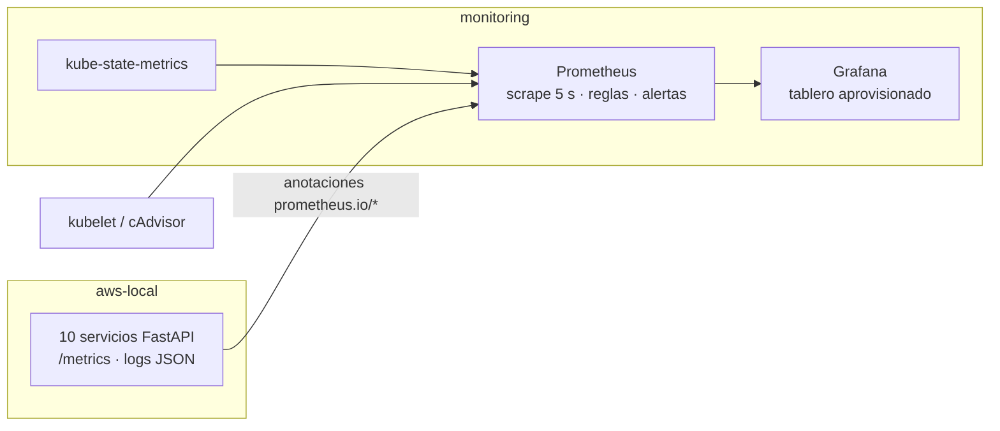

# Observabilidad de JOBBI: Prometheus + Grafana en Minikube

Caso de uso observado: **registrar el pago en efectivo de una contratación
completada y aplicar la comisión pendiente sobre la billetera del prestador.**



## 1. Cómo levantarlo

```bash
docker update --memory 6g --memory-swap 6g minikube   # una vez: el stack no cabe en 3 GB
./scripts/deploy-monitoring.sh
kubectl port-forward svc/grafana 3001:3000 -n monitoring      # http://localhost:3001
kubectl port-forward svc/prometheus 9090:9090 -n monitoring   # http://localhost:9090
```

Grafana abre directamente el tablero **JOBBI · Cobro de comisión en efectivo**
(refresco de 5 s). Para editarlo: `admin` / `jobbi` (credenciales solo de
desarrollo).

| Componente | Qué aporta | Manifiesto |
|---|---|---|
| Prometheus v2.54 | Scrape de los Pods anotados, de cAdvisor (vía kubelet) y de kube-state-metrics; reglas de grabación y alertas; datos en un PVC de 2 Gi | [k8s/monitoring/prometheus.yaml](../k8s/monitoring/prometheus.yaml), [prometheus.yml](../k8s/monitoring/prometheus/prometheus.yml), [reglas.yml](../k8s/monitoring/prometheus/reglas.yml) |
| kube-state-metrics v2.13 | Límites de recursos, reinicios y motivo de terminación (OOMKilled) | [kube-state-metrics.yaml](../k8s/monitoring/kube-state-metrics.yaml) |
| Grafana 11.2 | Fuente de datos y tablero aprovisionados desde el repositorio | [grafana.yaml](../k8s/monitoring/grafana.yaml), [jobbi-caso-uso.json](../k8s/monitoring/grafana/jobbi-caso-uso.json) |

## 2. Instrumentación de los servicios

Todo sale de [common/observabilidad.py](../services/common/observabilidad.py) y
entra en cada servicio a través de `crear_servicio`: no hay que tocar los
endpoints para medirlos. Dependencia nueva: `prometheus-client`.

- **RED:** el histograma `jobbi_http_request_duration_seconds{service,method,route,status}`.
  La ruta es la plantilla (`/contrataciones/{contratacion_id}/check-out`), así la
  cardinalidad no crece. `/health` y `/metrics` no cuentan.
- **Negocio:** gauges calculados **en la base, en el momento del scrape**. No
  se pierden al reiniciar un Pod y no se desvían de la fuente de verdad.
- **Consumidores:** `jobbi_eventos_consumidos_total{consumidor,resultado}` y
  `jobbi_cobro_latencia_seconds` (check-out → billetera).

### Métricas técnicas (tabla 8.1.2)

| Métrica | Dimensión | PromQL (panel) | SLO |
|---|---|---|---|
| Tasa de solicitudes | Rate | `sum by (route) (rate(jobbi_http_request_duration_seconds_count{service="gateway"}[1m]))` | ~12 TPS nominal sin degradación |
| Tasa de errores | Errors | `jobbi:http_errores:porcentaje` (5xx ÷ total, por servicio) | < 1 % |
| Latencia p50/p95/p99 | Duration | `histogram_quantile(0.95, sum by (le) (rate(…_bucket{service="gateway"}[1m])))` | p95 < 400 ms |
| CPU y memoria por Pod | Saturación | `node_namespace_pod_container:container_cpu_usage_seconds_total:sum_rate`, `container_memory_working_set_bytes` ÷ `kube_pod_container_resource_limits` | < 80 % del límite |
| Backlog del outbox | Saturación | `sum(jobbi_outbox_pendientes)` | < 10; alerta > 30 |
| Colas SQS | Saturación | `max by (cola, estado) (jobbi_sqs_mensajes)`. `estado` = `visibles` (esperando consumidor) o `en_vuelo` (entregados sin confirmar). La exportan su consumidor **y el gateway**, para que la cola se siga viendo con el consumidor caído: usa `max`, no `sum` | — |
| Flujo de eventos | Rate | `rate(jobbi_eventos_publicados_total{tema}[30s])` (relay del outbox) frente a `rate(jobbi_eventos_consumidos_total{consumidor}[30s])` | publicados ≈ consumidos |
| Latencia del cobro asíncrono | Duration | `histogram_quantile(0.95, …jobbi_cobro_latencia_seconds_bucket…)` | ventana de consistencia eventual |

### Métricas de negocio (tabla 8.1.3)

| Métrica | Fuente | PromQL | Meta | Estado |
|---|---|---|---|---|
| Tasa de recaudo de comisión en efectivo | `jobbi_comisiones_cobradas_pesos` (Monetización) ÷ `jobbi_comisiones_facturadas_efectivo_pesos` (Contrataciones) | `jobbi:recaudo_comision_efectivo:porcentaje` | ≥ 95 % | ✅ medida |
| Eventos en la DLQ | `jobbi_sqs_mensajes{cola=~".*-dlq"}` (las dos DLQ) | `jobbi:eventos_en_dlq` | = 0 (P2 si > 0) | ✅ medida |
| Billeteras bloqueadas y saldo pendiente (RN-04) | `jobbi_billeteras_bloqueadas`, `jobbi_saldo_pendiente_pesos` | `sum(…)` | — | ✅ medida |
| Tasa de contacto tras búsqueda (match rate) | `jobbi_contactos_iniciados` (con `busquedaOrigenId`) ÷ `jobbi_busquedas_registradas` | `jobbi:match_rate:porcentaje` | ≥ 35 % | ✅ medida |
| Tiempo de verificación del prestador | — | — | ≤ 48 h | Fuera de alcance: no pertenece al caso de uso y no se integra el servicio real de verificación |

**Cómo nace el match rate.** Entrar a la pantalla *Resultados* ejecuta
`POST /api/bff/busquedas`: el gateway registra la búsqueda en Mercado
(`POST /busquedas`, con los filtros y la ubicación del demandante) y devuelve
el catálogo junto con el id de la búsqueda. Si el demandante contacta a un
prestador desde esos resultados, el contacto guarda `busquedaOrigenId`. Mercado
solo acepta como origen una búsqueda real del mismo demandante, así que un id
ajeno no infla la tasa. Los contactos que se abren desde *Prestadores cerca de
ti* o al repetir un servicio no cuentan como contacto tras búsqueda.

### Infraestructura (tabla 8.1.4)

Los paneles que antes salían en **N/A** se alimentan de cAdvisor, que Prometheus
lee a través del API server (`/api/v1/nodes/<nodo>/proxy/metrics/cadvisor`), y
de la regla de grabación `node_namespace_pod_container:container_cpu_usage_seconds_total:sum_rate`,
que se define en [reglas.yml](../k8s/monitoring/prometheus/reglas.yml) porque en
Minikube no la trae nadie. Para el Fallo 4 están los paneles *Reinicios* y
*OOMKilled*, que vienen de kube-state-metrics.

### Alertas (Prometheus → Alerts)

`EventosEnDLQ` (P2), `TasaDeErroresAlta` (> 1 %), `LatenciaP95Alta` (> 400 ms),
`BacklogOutboxAlto` (> 30), `RecaudoBajo` (< 95 %), `PodCercaDelLimiteDeMemoria`
(> 80 %), `ContenedorOOMKilled` (P2).

## 3. Logs estructurados y traceId (8.2 y 8.3)

Cada línea que escriben los servicios es un JSON con `timestamp, level, service,
traceId, message`. Los hechos de negocio agregan `business_event`:

| `business_event` | Servicio | Cuándo |
|---|---|---|
| `contratacion_completada` | contrataciones | check-out guardado junto con su evento en el outbox |
| `comision_aplicada` | monetizacion | comisión cargada a la billetera (con `latenciaMs`) |
| `billetera_bloqueada` | monetizacion | el cargo hizo cruzar el umbral (WARNING) |
| `evento_duplicado` | monetizacion, comunicacion | el Idempotent Receiver descartó una reentrega |
| `cobro_fallido` | monetizacion | error al procesar: SQS lo reentrega y luego va a la DLQ (ERROR) |
| `prestador_notificado` | comunicacion | aviso de bloqueo entregado |
| `busqueda_registrada` / `contacto_iniciado` | mercado | búsqueda ejecutada / contacto abierto (con su `busquedaOrigenId`) |

Solo se registran ids y montos: nunca el documento, el correo ni datos
bancarios (OWASP A04).

**Recorrido del traceId**, por tramos (8.2.3):

1. El **gateway** lo toma de `X-Trace-Id` o lo crea, y lo propaga en todas sus
   llamadas a los servicios.
2. **Contrataciones** cierra la contratación y escribe el evento en el outbox, con
   el `traceId` dentro del payload, en la misma transacción.
3. **Salto asíncrono:** outbox → SNS → SQS.
4. **Monetización** retoma el `traceId` del evento: idempotencia, estrategia,
   movimiento y billetera. Si la billetera se bloquea, `BILLETERA_BLOQUEADA`
   lleva el mismo `traceId`.
5. **Comunicación** lo retoma y lo propaga a Identidad al resolver el destinatario.

```bash
# Seguir un cobro de punta a punta:
T=<traceId>
for d in api-gateway contrataciones servicio-monetizacion comunicacion; do
  kubectl logs -n aws-local deploy/$d --tail=2000 | grep "$T"
done
```

No hay un backend de trazas (Jaeger/Tempo) ni de logs (Loki): el stack acordado
es Prometheus + Grafana. La correlación se hace por el `traceId` de los logs.
