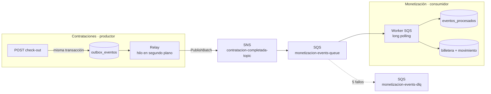
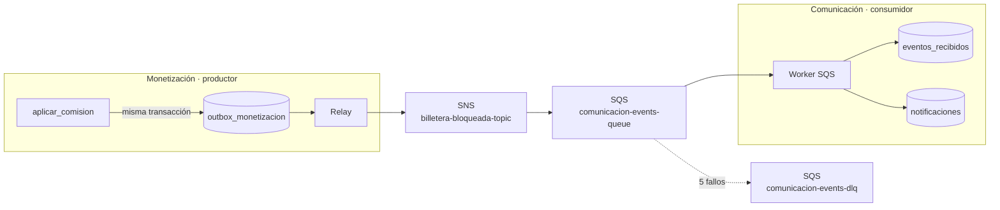

# Pub/Sub en JOBBI: cobro de comisiones por eventos

Cuando un servicio termina (check-out), la comisión del prestador ya **no** se
cobra con una llamada HTTP del gateway a Monetización. Contrataciones publica el
evento `CONTRATACION_COMPLETADA` y Monetización lo consume y cobra por su cuenta.
Ninguno de los dos contextos conoce al otro.



---

## 1. Cómo está implementado

### Productor: Transactional Outbox (Contrataciones)

Publicar en SNS directamente desde el check-out tiene dos fallos posibles, y
ninguno es aceptable:

- si SNS falla **después** de guardar el check-out, la comisión se pierde;
- si se publica **antes** y el guardado falla, se cobra un servicio que no se cerró.

Por eso se usa el patrón *Transactional Outbox*:

1. **El check-out escribe el evento en la tabla `outbox_eventos` en la misma
   transacción** que marca la contratación como `COMPLETADA`
   ([contrataciones/main.py](../services/contrataciones/main.py)). O se guardan
   los dos o ninguno.
2. **Un relay** ([contrataciones/outbox.py](../services/contrataciones/outbox.py))
   corre en un hilo, lee los eventos `PENDIENTE`, los publica en SNS con
   `PublishBatch` (hasta 10 por llamada) y los marca `PUBLICADO`. El check-out
   lo despierta en el momento, así que la publicación tarda milisegundos.
3. **Si SNS no responde**, el evento sigue `PENDIENTE`, se anota el intento y el
   error, y el relay reintenta con espera creciente (hasta 10 s).
4. **Con varias réplicas**, `SELECT … FOR UPDATE SKIP LOCKED` hace que cada una
   tome eventos distintos.
5. **Una restricción única `(tipo, agregadoId)`** impide que dos check-out
   simultáneos de la misma contratación dejen dos eventos.

El evento lleva un `eventoId` propio, que es la clave de la deduplicación:

```json
{
  "eventoId": "…", "tipo": "CONTRATACION_COMPLETADA", "version": 1,
  "ocurridoEn": "2026-09-23T21:28:04",
  "contratacionId": "…", "prestadorId": "…", "demandanteId": "…", "oficioId": "…",
  "valorAcordado": 90000, "medioPago": "EFECTIVO",
  "porcentajeComisionAplicado": 0.18, "montoComision": 16200,
  "evento": "CONTRATACION_COMPLETADA", "monto": 16200, "servicio_id": "…"
}
```

Las tres últimas claves mantienen la compatibilidad con el consumidor original.

### Broker: SNS + SQS + DLQ (LocalStack)

[scripts/init-aws-local.sh](../scripts/init-aws-local.sh) crea el tema, la cola,
la DLQ y la suscripción. Se puede correr varias veces sin duplicar nada, y
**LocalStack lo ejecuta solo cada vez que arranca** (*init hook* en
`/etc/localstack/init/ready.d`). Como LocalStack no guarda estado, un reinicio no
deja al sistema sin cola. En Kubernetes el script va en el ConfigMap
`localstack-init` ([k8s/localstack-deployment.yaml](../k8s/localstack-deployment.yaml)),
y el Pod solo se marca *Ready* cuando el hook terminó.

| Recurso | Configuración |
|---|---|
| `contratacion-completada-topic` (SNS) | tema al que publica Contrataciones |
| `monetizacion-events-queue` (SQS) | suscrita al tema; `VisibilityTimeout` 30 s |
| `monetizacion-events-dlq` (SQS) | recibe los mensajes que fallan 5 veces (`RedrivePolicy`) |

Usar un tema en vez de una cola directa es lo que hace que sea Pub/Sub: si
mañana otro contexto (Comunicación, analítica) necesita el mismo evento, se
suscribe con su propia cola y el productor no cambia.

### Consumidor: worker SQS idempotente (Monetización)

[monetizacion/sqs_worker.py](../services/monetizacion/sqs_worker.py):

- **Long polling:** 2 hilos, cada uno pide lotes de hasta 10 mensajes y espera
  hasta 10 s a que lleguen, sin sondear en vacío.
- **Idempotent Consumer:** SNS/SQS y el outbox entregan *al menos una vez*, así
  que el mismo evento puede llegar dos veces. Cada `eventoId` se guarda en
  `eventos_procesados` en la misma transacción que el cobro, y un duplicado
  choca con la clave primaria y se descarta sin tocar la billetera.
- **Sin pérdida:** el mensaje se borra de la cola **solo después del commit**. Si
  el proceso falla, SQS lo reentrega al vencer el `VisibilityTimeout`, y tras 5
  intentos lo manda a la DLQ.
- **Cobro atómico:** el saldo se suma en SQL (`saldo = saldo + monto`), no
  leyendo y reescribiendo, para no perder cobros con varios consumidores.

La regla de cobro vive en un solo lugar
([monetizacion/billetera.py](../services/monetizacion/billetera.py)) y la usan
el worker SQS: **no existe otro camino de cobro** (ADR-002). Dentro de ella:

- **Strategy** ([monetizacion/comisiones.py](../services/monetizacion/comisiones.py)):
  el worker cobra con `ComisionCongelada`, es decir, con el porcentaje que quedó
  escrito en la contratación (RN-05/06), aunque el prestador haya cambiado de
  plan después. `ComisionPlanFree` (18 %) y `ComisionPlanPro` (12 %) son la
  tarifa vigente que publica `/planes` y que el gateway congela al aceptar.
- **Repository** ([monetizacion/repositorio.py](../services/monetizacion/repositorio.py),
  [contrataciones/repositorio.py](../services/contrataciones/repositorio.py),
  [comunicacion/repositorio.py](../services/comunicacion/repositorio.py)): el
  camino de escritura del caso de uso (aceptar, check-in, check-out, cobro,
  pago, aviso) no toca el ORM; las reglas reciben y devuelven objetos del
  dominio y se prueban con un repositorio en memoria
  ([test_repositorio.py](../services/tests/test_repositorio.py)). La transacción
  (Unit of Work) la cierra la capa de aplicación. Las consultas de solo
  lectura (listados, resúmenes, métricas) leen directo, como lado de consulta.
- **Specification** ([monetizacion/especificaciones.py](../services/monetizacion/especificaciones.py)):
  `EspecificacionPrestadorBloqueado` bloquea la billetera cuando
  `saldoPendiente >= umbral` (RN-04; el umbral exacto ya bloquea).
- **Pago en efectivo:** junto con el cargo se registra un `Pago` con
  `referenciaPasarela = EFECTIVO`, una sola vez por contratación.

### Segundo evento: BILLETERA_BLOQUEADA (Monetización → Comunicación)



- Cuando un cargo hace que la billetera **pase** de no bloqueada a bloqueada,
  Monetización guarda `BILLETERA_BLOQUEADA` en su propio outbox, en la misma
  transacción que el cargo. Los cargos siguientes a una billetera ya bloqueada
  no repiten el aviso.
- El mecanismo del outbox y del relay es el mismo que el de Contrataciones
  ([common/outbox.py](../services/common/outbox.py)); cada contexto tiene su
  propia tabla, en su propia base.
- Comunicación ([comunicacion/sqs_worker.py](../services/comunicacion/sqs_worker.py))
  consume con idempotencia (`eventos_recibidos`), le pide a Identidad el
  `usuarioId` del prestador y deja la notificación `BILLETERA_BLOQUEADA`. Si
  Identidad no responde, el mensaje se reintenta y termina en su DLQ.
- Estado: `GET /api/monetizacion/outbox` (productor) y
  `GET /api/comunicacion/eventos/estado-worker` (consumidor).
- Efecto en el mercado: el gateway rechaza con `409` que un prestador con la
  billetera bloqueada proponga o acepte un servicio nuevo. Si Monetización no
  responde, deja pasar: un contexto caído no paraliza el mercado.

### Gateway y frontend

- `POST /api/bff/contrataciones/{id}/check-out` ya no llama a Monetización:
  responde `cobroAsincrono: true` y `cobro: null`.
- `GET /api/bff/contrataciones/{id}/cobro` junta lo que sabe cada lado y
  devuelve la etapa: `EN_OUTBOX → PUBLICADO → COBRADO`.
- `GET /api/bff/pubsub/estado` es el tablero: outbox, colas, DLQ, worker y
  latencias.
- **Pantalla del prestador (check-in/check-out):** tras el check-out aparece la
  tarjeta *Cobro por eventos*, que avanza en vivo por las tres etapas y muestra
  cuántos ms tardó el cobro.
- **Métricas (botón «Métricas»):** el panel *Pub/Sub · CONTRATACION_COMPLETADA*
  se refresca cada 2 s. Durante una prueba de carga se ve la cola llenarse y
  vaciarse.

### Un solo camino de cobro

El cobro de comisiones es siempre asíncrono. No hay endpoint que cargue una
billetera de forma síncrona (se eliminaron `POST /comisiones` y `POST /cobrar`),
ni modo "sin broker": `./scripts/run-backend-local.sh` exige Docker para
levantar LocalStack. Y el gateway no reenvía escrituras directas a los servicios
salvo una lista corta sin reglas de dominio (mensajes del chat y alta del
catálogo): todo lo demás pasa por `/api/bff/…`, que valida las reglas.

### Variables de entorno

| Variable | Servicio | Por defecto |
|---|---|---|
| `AWS_ENDPOINT_URL` | contrataciones, monetización, comunicación | `http://localstack.aws-local.svc.cluster.local:4566` |
| `SNS_ENABLED` / `SNS_TOPIC_NAME` | contrataciones | `true` / `contratacion-completada-topic` |
| `SNS_ENABLED` / `SNS_TOPIC_BILLETERA_BLOQUEADA` | monetización | `true` / `billetera-bloqueada-topic` |
| `OUTBOX_INTERVALO_SEGUNDOS` | contrataciones, monetización | `1.0` |
| `SQS_ENABLED` / `QUEUE_NAME` / `QUEUE_DLQ_NAME` | monetización | `true` / `monetizacion-events-queue` / `monetizacion-events-dlq` |
| `SQS_HILOS` | monetización | `2` |
| `SQS_ENABLED` / `QUEUE_COMUNICACION` / `QUEUE_COMUNICACION_DLQ` | comunicación | `true` / `comunicacion-events-queue` / `comunicacion-events-dlq` |
| `SERVICIO_IDENTIDAD_URL` | comunicación | `http://identidad.aws-local.svc.cluster.local:8001` |

---

## 2. Cómo probarlo

### a) Pruebas automatizadas (sin LocalStack)

```bash
.venv/bin/pip install -r services/requirements-dev.txt
cd services && ../.venv/bin/python -m pytest -v
```

Son 10 pruebas en [services/tests/test_pubsub.py](../services/tests/test_pubsub.py).
Reemplazan SNS por un doble de prueba y verifican lo siguiente:

- el check-out guarda el evento en la misma transacción que el cierre;
- repetir el check-out no emite un segundo evento;
- el relay publica, y si SNS está caído el evento espera y sale cuando vuelve;
- el consumidor cobra, y un mensaje duplicado o republicado no cobra dos veces;
- un mensaje ilegible se deja para reintento (camino a la DLQ);
- la latencia es correcta aunque el mensaje traiga la hora en UTC.

Y 19 más en [services/tests/test_billetera_y_patrones.py](../services/tests/test_billetera_y_patrones.py)
para el bloqueo y su aviso: umbral − 1 / exacto / + 1, un solo
`BILLETERA_BLOQUEADA` por bloqueo, comisión congelada tras cambiar de plan,
pago en efectivo registrado una vez, consumidor idempotente de Comunicación,
transiciones inválidas de la contratación y el rechazo del gateway.

### b) Levantar el sistema

**En Minikube** (igual que antes; LocalStack se aprovisiona solo):

```bash
./scripts/deploy-all.sh
kubectl port-forward svc/jobbi-frontend 3000:3000 -n aws-local
kubectl port-forward svc/api-gateway 8080:8080 -n aws-local
```

**En local, sin Kubernetes** (necesita Docker para LocalStack):

```bash
./scripts/run-backend-local.sh          # levanta LocalStack + 10 servicios
cd frontend && pnpm dev                 # http://localhost:3000
```

### c) En el frontend

1. Registra un **prestador** y luego, en otra ventana privada, un **demandante**.
2. El demandante busca al prestador, pulsa **Contactar** y propone la tarifa
   (medio de pago **efectivo**). El prestador la confirma desde el chat.
3. El prestador abre la contratación (Dashboard → *Ver detalle*) y hace
   **Check-in** y luego **Check-out**.
4. Debajo aparece **Cobro por eventos**, que marca en segundos las tres etapas:
   *Evento guardado → Publicado en SNS → Comisión cargada a tu billetera*.
5. Pulsa **Métricas** (arriba a la derecha): el panel Pub/Sub muestra el evento
   publicado, la cola y la DLQ en 0, y la latencia check-out → cobro.
6. **Billetera** muestra el movimiento `Comision` y el saldo pendiente.

**Para ver la resiliencia desde la interfaz**, repite el paso 3 con el broker o el
consumidor apagado (ver la sección siguiente). La tarjeta se queda en
*"Broker no disponible, reintento n…"* o en *Publicado*, y termina en *Cobrada*
sola cuando el componente vuelve.

### d) Prueba funcional de punta a punta

```bash
./scripts/test-pubsub.sh                      # flujo completo + verificaciones
./scripts/test-pubsub.sh --consumidor-caido   # (Minikube) apaga Monetización antes del check-out
```

El script crea sus propias cuentas, recorre contacto → tarifa → check-in →
check-out, sigue el evento etapa por etapa y comprueba lo siguiente:

- el saldo aumenta exactamente en la comisión;
- repetir el check-out no deja un segundo evento ni cobra dos veces;
- con `--consumidor-caido`, el evento espera en SQS y se cobra cuando
  Monetización vuelve.

**Broker caído** (manual, en Minikube):

```bash
kubectl scale deployment/localstack -n aws-local --replicas=0
# haz un check-out en la app → la tarjeta queda "reintentando", el outbox con el error:
curl -s localhost:8080/api/contrataciones/outbox?estado=PENDIENTE | jq '.items[0] | {intentos, ultimoError}'
kubectl scale deployment/localstack -n aws-local --replicas=1
# en unos segundos: la tarjeta pasa a "Cobrada"
```

En local es lo mismo con `docker stop jobbi-localstack` / `docker start jobbi-localstack`.

### e) Pruebas de carga, estrés y pico (k6)

```bash
./scripts/run-load-test.sh [e2e|sns] [humo|carga|estres|pico] [vus]
```

Usa `k6` si está instalado (`brew install k6`); si no, la imagen Docker
`grafana/k6`. En Windows: `.\scripts\run-load-test.ps1 e2e estres 80`.

| Prueba | Qué ejercita |
|---|---|
| **`e2e`** ([e2e-checkout-pubsub.js](../tests/k6/e2e-checkout-pubsub.js)) | Cada iteración es un servicio real por el gateway: contactar → proponer → aceptar → check-in → **check-out**. Una muestra de iteraciones sondea hasta ver el cobro. Necesita el túnel del gateway (8080). |
| **`sns`** ([load-test-pubsub.js](../tests/k6/load-test-pubsub.js)) | Solo el broker: publica directo en SNS y mide la ingesta del worker. Necesita los túneles de LocalStack (4566) y Monetización (8000). |

| Escenario | Perfil | Pregunta que responde |
|---|---|---|
| `humo` | 1 VU, 3 iteraciones | ¿Funciona el camino completo? |
| `carga` | sube a 10 VUs y sostiene 1 min | ¿Cumple los objetivos de servicio? |
| `estres` | escalones de 25 % hasta `VUS` (60), luego baja | ¿Dónde se degrada y se recupera? |
| `pico` | línea base → salto a `VUS` (80) → vuelta | ¿Absorbe una ráfaga? |

Métricas propias que reporta la prueba `e2e`:

- `pubsub_latencia_cobro_ms`: tiempo del check-out al cobro visto por el cliente.
- `pubsub_cobro_a_tiempo`: porcentaje de la muestra cobrado en menos de 30 s.
- `pubsub_servicios_cerrados`: eventos producidos.
- `pubsub_consistencia_final`: al terminar, espera la consistencia eventual y
  compara, por cada prestador, **la comisión de sus servicios completados
  (Contrataciones) con la comisión cobrada (Monetización)**. Además exige la DLQ
  vacía. Este umbral (`rate==1`) no se relaja en ningún escenario.

Los umbrales son estrictos en `humo`/`carga` y más laxos en `estres`/`pico`,
donde el objetivo es encontrar el límite sin perder eventos. El resumen JSON
queda en `tests/k6/resultados/`. Mientras corre, abre **Métricas** en el
frontend para ver la cola en vivo.

#### Resultados de referencia

**Minikube** (2 CPU, 3 GB; PostgreSQL; k6 en Docker por `kubectl port-forward`):

| Escenario | Peticiones | Errores HTTP | Servicios cerrados → cobrados | p95 check-out | p95 check-out → cobro (cliente) | DLQ |
|---|---|---|---|---|---|---|
| `e2e carga` (10 VUs) | 8.781 | 0 % | 2.028 → todos | 93 ms | 219 ms | 0 |
| `e2e estres` (60 VUs) | 24.521 | 0 % | 5.945 → todos | 808 ms | 927 ms | 0 |

**Backend local** (SQLite + LocalStack en Docker, MacBook):

| Escenario | Peticiones | Errores HTTP | Servicios cerrados → cobrados | p95 check-out | p95 check-out → cobro (cliente) | DLQ |
|---|---|---|---|---|---|---|
| `e2e carga` (10 VUs) | 11.071 | 0 % | 2.551 → todos | 29 ms | 222 ms | 0 |
| `e2e estres` (60 VUs) | 35.872 | 0 % | 8.703 → todos | 607 ms | 714 ms | 0 |
| `e2e pico` (80 VUs) | 14.501 | 0 % | 3.481 → todos | 937 ms | 1,1 s | 0 |
| `sns carga` (20 VUs) | 7.919 | 0 % | 7.916 procesados | — | — | 0 |

En todos los casos la consistencia final fue del 100 %: ningún evento perdido ni
cobrado dos veces. La publicación outbox → SNS se mantuvo en ~10 ms p95. Bajo
estrés crece la latencia HTTP de los servicios (y en Minikube, el túnel de
`port-forward`), no la del Pub/Sub.

---

## 3. Qué se encontró al probar

- **El gateway saturaba las conexiones bajo estrés.** Con el pool por defecto
  de `httpx` (20 conexiones reutilizables), a 60 VUs el gateway abría y cerraba
  cientos de conexiones por segundo hacia los servicios. Eso desbordaba la cola
  TCP (128 en macOS) y el 80 % de las peticiones fallaba con `ConnectError`. Se
  corrigió reutilizando conexiones (`httpx.Limits` en
  [gateway/main.py](../services/gateway/main.py)) y ahora el gateway registra
  esos fallos en lugar de ocultarlos. Aun con ese 80 % de fallos, el Pub/Sub
  quedó consistente: 10.340 publicados = 10.340 cobrados.
- **Timeouts de k6 en Docker Desktop.** k6 en contenedor contra el puerto
  publicado de LocalStack daba ~1 % de `dial: i/o timeout` por el doble salto de
  red. Dentro de la red de LocalStack daba 0 %, así que era un problema del
  arnés, no del sistema. `run-load-test.sh` ya usa esa red en local.
- **Caída del consumidor:** el mensaje que el worker muerto tenía en *long
  polling* reaparece al vencer el `VisibilityTimeout` (~30 s). No se pierde; es
  la semántica *al menos una vez* de SQS.

## 4. Límites conocidos

- **LocalStack no persiste.** Si se reinicia con mensajes aún en la cola (ya
  publicados, sin consumir), esos mensajes se pierden. El outbox solo protege
  hasta la publicación. En AWS real SQS es durable. Una tarea de reconciliación
  que compare contrataciones completadas contra cobros cerraría ese hueco.
- **Permisos de la cola:** en AWS real, la cola necesita una política que
  permita a SNS escribir en ella. LocalStack no la exige.
- **La DLQ no tiene reproceso automático.** Para revisarla:
  `awslocal sqs receive-message --queue-url …/monetizacion-events-dlq`.
- **El outbox no se purga.** Los eventos `PUBLICADO` se acumulan; en producción
  se archivarían o borrarían periódicamente.
