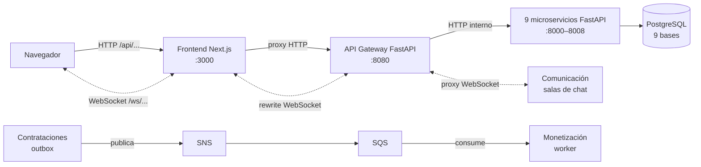
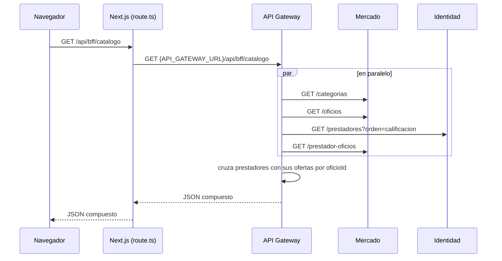
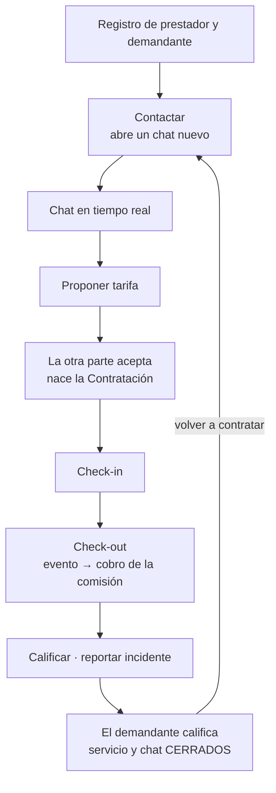
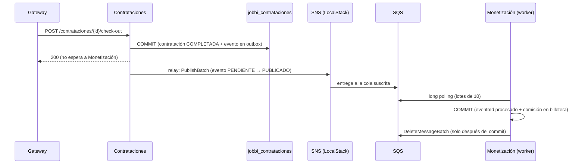
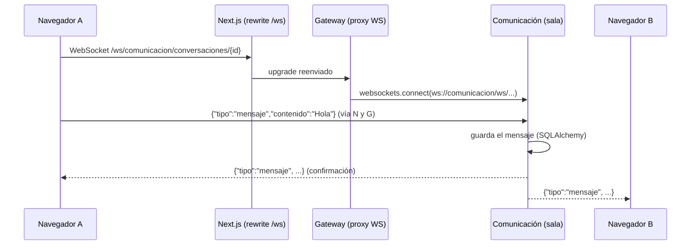

# JOBBI — Arquitectura, tecnologías y flujo de ejecución

Este documento describe **con qué está construido** JOBBI, **cómo viaja una
petición** desde el navegador hasta la base de datos y **qué cambios de
arquitectura se hicieron** sobre la versión inicial, con la tecnología usada en
cada uno. Refleja el código actual de la rama `front`.

Documentos relacionados:
- [README principal](../README.md): despliegue paso a paso.
- [README del backend](../services/README.md): catálogo de endpoints.
- [pubsub.md](pubsub.md): detalle del Pub/Sub y resultados de carga.

---

## 1. Vista general

JOBBI es un marketplace de oficios: demandantes que contratan a prestadores. El
sistema tiene cuatro capas y **cuatro formas de comunicación**:



| Estilo | Tecnología | Se usa para |
|---|---|---|
| **HTTP síncrono** | Next Route Handler → FastAPI + httpx | Consultas y escrituras normales; el gateway compone vistas (BFF) |
| **Eventos asíncronos (Pub/Sub)** | SNS + SQS en LocalStack, boto3 | Cobro de la comisión al cerrar un servicio (`CONTRATACION_COMPLETADA`) |
| **WebSocket** | Rewrite de Next → proxy del gateway (`websockets`) → FastAPI | Chat en tiempo real: mensajes, "escribiendo…", presencia y cierre del chat |
| **Sondeo (polling)** | Hook `useDatos` con `cadaMs` | Solicitudes, seguimiento, billetera, métricas y avisos emergentes |

Todo corre dentro de un clúster local de **Minikube**, en el namespace
`aws-local`.

---

## 2. Tecnologías

### Frontend (`frontend/`)

| Tecnología | Versión | Para qué se usa |
|---|---|---|
| **Next.js** (App Router) | 16.3 | Servidor web, proxy HTTP (Route Handler) y proxy WebSocket (rewrite) hacia el gateway |
| **React** | 19 | Interfaz: una sola página con navegación por estado |
| **TypeScript** | 5.7 | Tipado del cliente de API (`lib/api.ts`) |
| **WebSocket API** del navegador | — | Chat en tiempo real (`components/jobbi/use-chat.ts`) |
| **Tailwind CSS** | 4 | Estilos |
| **shadcn/ui + Base UI** | — | Componentes base (`components/ui/`) |
| **lucide-react** | — | Íconos |
| **pnpm** | 12 | Gestor de paquetes |
| **Node.js** | 22 (alpine) | Runtime de la imagen Docker (`output: standalone`) |

### Backend (`services/`)

| Tecnología | Versión | Para qué se usa |
|---|---|---|
| **Python** | 3.11 | Lenguaje de todos los servicios |
| **FastAPI** | 0.115 | Framework HTTP **y WebSocket** de cada microservicio y del gateway |
| **Uvicorn** | 0.34 | Servidor ASGI; atiende también el WebSocket |
| **Pydantic** | 2.12 | Esquemas de entrada y salida (contrato de la API) |
| **SQLAlchemy** | 2.0 | ORM, consultas, `FOR UPDATE SKIP LOCKED` y migración aditiva de columnas |
| **psycopg** | 3.2 | Driver de PostgreSQL |
| **httpx** | 0.28 | Cliente HTTP asíncrono del gateway, con pool de conexiones ajustado |
| **websockets** | 15 | Cliente WebSocket del gateway hacia Comunicación |
| **boto3** | 1.35 | Publicación en SNS (Contrataciones) y consumo de SQS (Monetización) |
| **anyio** | (con FastAPI) | Difundir a una sala WebSocket desde un endpoint síncrono |
| **email-validator** | 2.2 | Validación del correo en el registro |
| **pytest** | 8.3 | Pruebas automatizadas (`services/tests/`) |

### Datos, infraestructura y pruebas

| Tecnología | Para qué se usa |
|---|---|
| **PostgreSQL 16** (StatefulSet + PVC 1 Gi) | Una base por contexto: `jobbi_identidad`, `jobbi_mercado`, … |
| **SQLite** | Alternativa en local cuando no hay `DATABASE_URL` (un archivo por contexto) |
| **Docker** | Dos imágenes: `jobbi/backend:v1` y `jobbi/frontend:v1` |
| **Kubernetes / Minikube** | Orquestación local: Deployments, Services, Secret, ConfigMaps |
| **LocalStack 3.0** | Emula AWS **SNS** y **SQS** (con DLQ); se aprovisiona solo con un *init hook* |
| **AWS CLI** / `awslocal` | Crear el tema, la cola, la DLQ y la suscripción |
| **k6** (grafana/k6) | Pruebas de carga, estrés y pico (`tests/k6/`) |

---

## 3. Arquitectura del backend

### Un microservicio por contexto delimitado

Cada contexto del modelo de dominio es un servicio independiente, con su Pod, su
`Service` de Kubernetes y su propia base de datos.

| Servicio | Contexto | Puerto | Base de datos |
|---|---|---|---|
| `identidad` | Usuarios y perfiles (demandante / prestador) | 8001 | `jobbi_identidad` |
| `mercado` | Categorías, oficios, ofertas, contactos | 8002 | `jobbi_mercado` |
| `contrataciones` | Acuerdos de tarifa, ciclo de vida del servicio y **outbox de eventos** | 8003 | `jobbi_contrataciones` |
| `comunicacion` | Conversaciones (**un chat por servicio**), mensajes, notificaciones y **salas WebSocket** | 8004 | `jobbi_comunicacion` |
| `confianza` | Verificaciones y reseñas | 8005 | `jobbi_confianza` |
| `monetizacion` | Planes, comisiones, billetera y **worker SQS** | 8000 | `jobbi_monetizacion` |
| `soporte` | Incidentes | 8006 | `jobbi_soporte` |
| `adquisicion` | Aliados de distribución y referidos | 8007 | `jobbi_adquisicion` |
| `proteccion` | Seguros *(reservado)* | 8008 | `jobbi_proteccion` |
| `gateway` | Punto de entrada único (HTTP y WebSocket) | 8080 | — |

Reglas que mantienen la separación:

- **Las referencias entre contextos son solo UUID**, sin `ForeignKey`. Por
  ejemplo, una `Contratacion` guarda `prestadorId`, pero el nombre del
  prestador vive en Identidad.
- **PostgreSQL no permite JOIN entre bases distintas**, así que un servicio no
  puede leer los datos de otro aunque quiera.
- **Solo el gateway cruza fronteras de forma síncrona**, pidiendo cada dato al
  servicio dueño.
- **Entre Contrataciones y Monetización la comunicación es por eventos:**
  ninguno de los dos conoce al otro.

### Una sola imagen, diez procesos

Todos los servicios comparten la imagen `jobbi/backend:v1`. Lo que cambia entre
un Deployment y otro es la variable `SERVICE_MODULE`:

```sh
uvicorn ${SERVICE_MODULE}.main:app --host 0.0.0.0 --port ${PORT}
```

### Estructura interna de cada servicio

| Archivo | Papel |
|---|---|
| `main.py` | Endpoints FastAPI (HTTP y, en Comunicación, WebSocket) |
| `models.py` | Esquemas Pydantic: lo que devuelve la API |
| `tablas.py` | Tablas SQLAlchemy: cómo se guarda |
| `outbox.py` (Contrataciones) | Registro de eventos y relay hacia SNS |
| `sqs_worker.py`, `billetera.py` (Monetización) | Consumidor SQS y regla de cobro |
| `salas.py` (Comunicación) | Salas de chat en tiempo real |

Código compartido en `services/common/`:

- `service.py` → `crear_servicio()`: crea la app con `/health`, `/`, `/docs` y
  CORS; además, `resumen_latencias()` para métricas.
- `db.py` → conexión, espera a que la base esté lista, `create_all`,
  **`completar_columnas()`** (migración aditiva) y utilidades de paginación.
- `eventos.py` → contrato de los eventos y clientes AWS (endpoint, región,
  nombres del tema y de las colas).
- `enums.py` → vocabulario común (`EstadoContratacion`, `PlanPrestador`, …).

### El API Gateway (`services/gateway/`)

Tiene cinco tipos de rutas:

1. **Auth** (`/api/auth/registro`, `/api/auth/login`) → se reenvían a Identidad.
2. **BFF** (`/api/bff/...`) → **componen** varias llamadas a distintos servicios
   en paralelo (`asyncio.gather`) y devuelven una sola respuesta. Si un servicio
   no responde, esa parte llega como `null` en vez de tumbar toda la respuesta.
3. **Reglas de negocio entre contextos** → el **ciclo de vida de la
   contratación** (`_ciclo_desde`) y las escrituras que dependen de él:
   reseñas, incidentes, propuestas y cierre del chat.
4. **Proxy genérico HTTP** (`/api/{servicio}/{ruta}`) → reenvía GET y POST al
   servicio dueño, **salvo** las escrituras que tienen una regla (reseñas,
   incidentes, cerrar chats), que responde con 403 y remite a su ruta BFF.
5. **Proxy WebSocket** (`/ws/{servicio}/{ruta}`) → solo expone el chat de
   Comunicación.

Las URLs de cada servicio están en `gateway/registro.py`. Por defecto usan el
DNS interno del clúster (`identidad.aws-local.svc.cluster.local:8001`) y se
pueden sobrescribir con `SERVICIO_<NOMBRE>_URL` para correr en local.

---

## 4. Arquitectura del frontend

- **Una sola página.** `app/page.tsx` renderiza `JobbiApp`, que decide qué
  pantalla mostrar con un estado `screen` (`search`, `chat`, `requests`,
  `tracking`, `wallet`, …). No se usan rutas de Next para navegar.
- **Sesión en `localStorage`** (`components/jobbi/session.tsx`). Solo evita
  tener que volver a entrar al recargar; el backend no la valida.
- **Cliente de API tipado** (`lib/api.ts`). Todas las llamadas HTTP van a
  `/api/...` en el mismo origen.
- **Proxy HTTP** (`app/api/[...ruta]/route.ts`). El servidor de Next reenvía
  `/api/...` a `API_GATEWAY_URL`, que se lee en cada petición. Así no hace
  falta CORS y la URL del gateway se cambia sin reconstruir la imagen.
- **Proxy WebSocket** (`next.config.mjs`, *rewrite* de `/ws/*`). Ver la
  sección 7.5.
- **Hook `useDatos`** (`use-data.ts`): estados cargando / error / datos, y
  refresco periódico con `cadaMs`.
- **Hook `useChatEnVivo`** (`use-chat.ts`): la conexión WebSocket del chat.
- **`AvisosEnVivo`**: tarjetas emergentes cuando la otra parte hace algo.

---

## 5. Flujo de una petición HTTP

Ejemplo: el demandante abre la pantalla de búsqueda.



Cada microservicio, al recibir su parte, abre una sesión de SQLAlchemy contra
**su** base, ejecuta la consulta y devuelve el resultado validado con Pydantic.

---

## 6. Flujo de negocio de punta a punta

Las nueve bases **arrancan vacías**: no hay datos de ejemplo. Un servicio
completo sigue este ciclo:



| Paso | Llamada del frontend | Qué pasa en el backend |
|---|---|---|
| **Registro** | `POST /api/auth/registro` (+ oficio y oferta si es prestador) | Identidad crea `Usuario` y perfil; Mercado crea `Categoria`, `Oficio` y la oferta. |
| **Login** | `POST /api/auth/login` | Identidad busca el correo (sin contraseña); el rol se deduce del perfil. |
| **Contactar** | `POST /api/bff/contactar` | Mercado crea (o reutiliza) el `Contacto`. Comunicación devuelve el chat **abierto** de esa pareja o **crea uno nuevo** si todos están cerrados. Se avisa al prestador (`NUEVO_CONTACTO`). |
| **Chat** | WebSocket `/ws/comunicacion/conversaciones/{id}` | Comunicación guarda cada mensaje y lo difunde a la sala (sección 7.5). |
| **Proponer tarifa** | `POST /api/bff/acuerdos` | Se rechaza si el chat está cerrado o si hay un servicio anterior sin cerrar. Contrataciones guarda el `AcuerdoTarifa` (`PENDIENTE`), ligado a su chat. |
| **Aceptar tarifa** | `POST /api/bff/acuerdos/{id}/aceptar` | El gateway consulta el plan (Identidad) y su porcentaje (Monetización). Con ambas aceptaciones nace la `Contratacion`, con la comisión **congelada**. |
| **Check-in** | `POST /api/bff/contrataciones/{id}/check-in` | Contrataciones cambia el estado y se notifica al demandante. |
| **Check-out** | `POST /api/bff/contrataciones/{id}/check-out` | Contrataciones completa el servicio y, **en la misma transacción**, guarda el evento `CONTRATACION_COMPLETADA`. Monetización lo consume y cobra (sección 7.1). |
| **Calificar** | `POST /api/bff/resenas` | Una vez por parte y solo con el servicio terminado. La reseña del **demandante cierra el servicio y su chat**. |
| **Reportar incidente** | `POST /api/bff/incidentes` | Uno por servicio, mientras no esté cerrado. |
| **Cambio de plan** | `POST /api/bff/prestadores/{id}/plan` | Identidad y Monetización. No afecta a contrataciones ya acordadas. |

Las notificaciones (`TARIFA_PROPUESTA`, `SERVICIO_CONFIRMADO`,
`SERVICIO_CERRADO`, …) las escribe el gateway en Comunicación. Si esa escritura
falla, la operación principal sigue adelante.

---

## 7. Cambios de arquitectura implementados

Esta sección explica cada cambio hecho sobre la versión inicial: qué problema
resolvía, qué se decidió y cómo se implementó.

### 7.1 Pub/Sub para el cobro de comisiones

**Problema.** El check-out llamaba a Monetización por HTTP para cobrar la
comisión. Los dos contextos quedaban acoplados en el tiempo: si Monetización
estaba caída, el cobro fallaba o se perdía. Además, el Pub/Sub del proyecto
existía solo como demo manual: Contrataciones no publicaba nada desde el código.

**Decisión.** El cierre de un servicio publica un evento y Monetización cobra al
consumirlo. Se usan dos patrones para no perder ni duplicar cobros:
*Transactional Outbox* e *Idempotent Consumer*.



**Cómo se implementó:**

| Pieza | Tecnología | Dónde |
|---|---|---|
| **Outbox**: el evento se escribe en la misma transacción que el cierre; restricción única `(tipo, agregadoId)` | SQLAlchemy, PostgreSQL | `contrataciones/tablas.py` (`outbox_eventos`), `contrataciones/main.py` |
| **Relay**: hilo que publica los pendientes en lotes; `FOR UPDATE SKIP LOCKED` para varias réplicas; reintento con espera creciente si SNS cae | boto3 (`sns.publish_batch`), `threading` | `contrataciones/outbox.py` |
| **Broker**: tema `contratacion-completada-topic`, cola `monetizacion-events-queue`, DLQ tras 5 fallos | LocalStack SNS/SQS, `RedrivePolicy` | `scripts/init-aws-local.sh` |
| **Aprovisionamiento automático**: el script corre como *init hook* al arrancar LocalStack; el Pod está *Ready* solo cuando terminó | ConfigMap + `readinessProbe` de Kubernetes | `k8s/localstack-deployment.yaml` |
| **Consumidor idempotente**: registra cada `eventoId` en la misma transacción que el cobro; el duplicado choca con la clave primaria | boto3 (`receive_message` con long polling), SQLAlchemy | `monetizacion/sqs_worker.py`, tabla `eventos_procesados` |
| **Cobro atómico**: `saldo = saldo + monto` en SQL, no leer y reescribir | SQLAlchemy `update()` | `monetizacion/billetera.py` |
| **Un solo camino de cobro**: no hay cobro síncrono ni modo sin broker; el gateway solo reenvía escrituras sin reglas de dominio | Lista de permitidos del proxy | `gateway/main.py` (`_ESCRITURAS_DIRECTAS`) |
| **Observabilidad**: estado del outbox, colas, DLQ y latencias; tarjeta "Cobro por eventos" y panel en Métricas | FastAPI (BFF), React | `/api/bff/pubsub/estado`, `/api/bff/contrataciones/{id}/cobro` |

**Garantías:**
- Ningún cobro se pierde si SNS, SQS o Monetización caen: el evento espera en el
  outbox o en la cola.
- Ningún cobro se duplica, porque se deduplica por `eventoId`.

### 7.2 Pool de conexiones del gateway

**Problema.** En la prueba de estrés, a 60 usuarios virtuales, el 80 % de las
peticiones fallaba con `ConnectError`. El gateway usaba el pool por defecto de
httpx (20 conexiones reutilizables): el resto se abría y se cerraba en cada
llamada y desbordaba la cola TCP de los servicios (128 en macOS).

**Solución.** `httpx.Limits(max_connections=400, max_keepalive_connections=400,
keepalive_expiry=4.0)` en `gateway/main.py`. La expiración queda por debajo de
los 5 s en que uvicorn cierra una conexión ociosa. Además, el gateway ahora
**registra** los fallos de red en su log, en lugar de ocultarlos. Resultado: 0 %
de errores en estrés y pico.

### 7.3 Ciclo de vida de la contratación

**Problema.** Después del check-out se podía calificar varias veces (la reseña
se sobrescribía), reportar incidentes sin límite y en cualquier estado, y el
chat seguía mostrando el servicio viejo. No existía la noción de "servicio
cerrado".

**Decisión.** El servicio queda **cerrado cuando el demandante lo califica**.
La regla cruza tres contextos (el estado es de Contrataciones, las reseñas de
Confianza y los incidentes de Soporte), así que vive **en un solo lugar del
gateway**. Cada servicio aplica, además, la parte que le corresponde.

| Momento | Calificar | Reportar incidente | Nuevo servicio con esa persona |
|---|---|---|---|
| En curso | No | Sí (uno) | No |
| Terminado (check-out) | Sí, una vez por parte | Sí (uno) | No, falta calificar |
| **Cerrado** | No | No | Sí, en un chat nuevo |

**Cómo se implementó:**
- **Gateway:** `_ciclo_desde()` es una función pura que calcula `terminada`,
  `cerrada`, `puedeCalificar` y `puedeReportarIncidente`. Se entrega como
  `ciclo` en `/api/bff/contrataciones/{id}` y en la bandeja, y valida
  `/api/bff/resenas`, `/api/bff/incidentes` y `/api/bff/acuerdos`.
- **Cada servicio defiende lo suyo:**
  - Confianza responde 409 a una segunda reseña.
  - Soporte responde 409 a un segundo incidente.
  - Contrataciones rechaza un acuerdo nuevo mientras haya un servicio en curso
    con ese contacto.
- **Frontend:** las pantallas solo muestran lo que `ciclo` permite, y si el
  servicio se cerró en otra pestaña, lo explican.

### 7.4 Tiempo real por sondeo, Solicitudes y avisos

**Problema.** El prestador no veía en Solicitudes a un cliente que volvía a
escribirle o a proponerle una tarifa: la pantalla solo listaba contrataciones,
que existen hasta después del acuerdo. Además, las pantallas se cargaban una
sola vez.

**Cómo se implementó:**
- **Refresco periódico:** `useDatos(consulta, claves, { cadaMs })` repite la
  consulta en segundo plano cada `EN_VIVO_MS` = 3 s, sin volver a mostrar los
  esqueletos de carga, y **se pausa si la pestaña está oculta**
  (`document.hidden`). Lo usan Solicitudes, Dashboard, Seguimiento,
  Check-in/out, Billetera y Notificaciones.
- **Solicitudes:** se arma desde la bandeja (`/api/bff/mensajes`), que ya trae
  por chat el acuerdo, el servicio y su ciclo. `clasificarSolicitud()` separa
  lo que **necesita respuesta** (tarifa propuesta, chat nuevo, cliente que
  escribió) de lo que está **en curso**, y marca al **cliente que vuelve**.
- **Avisos emergentes** (`AvisosEnVivo`): sondea las notificaciones que ya
  escribe el gateway y muestra una tarjeta por cada una nueva: la última, con
  "y N avisos más". Tocarla lleva a la pantalla correspondiente.

Se eligió sondeo y no WebSocket para estas pantallas porque sus datos cambian
pocas veces por minuto y ya existían como consultas HTTP. El WebSocket se
reservó para el chat, donde la latencia importa.

### 7.5 Chat por servicio en tiempo real (WebSocket)

**Problema.** El chat era uno por pareja y para siempre, y los mensajes solo se
veían al recargar o con sondeo.

**Decisión:**
1. **Un chat por servicio.** Una conversación está `ABIERTA` mientras se
   negocia y se ejecuta su servicio. Cuando el demandante lo califica queda
   `CERRADA`: solo lectura, en "Chats anteriores". "Contactar" reutiliza el
   chat abierto o crea uno nuevo si todos están cerrados.
2. **WebSocket de punta a punta**, manteniendo al gateway como único punto de
   entrada.



**Cómo se implementó, por capa:**

| Capa | Tecnología | Qué hace |
|---|---|---|
| **Navegador** | WebSocket API, React (`use-chat.ts`) | Abre `/ws/...` en el mismo origen. Carga el historial por HTTP y lo vuelve a pedir al reconectar. Reconecta con espera creciente (1 s → 10 s). Si no hay conexión, envía por HTTP. Muestra "escribiendo…" y "En línea". |
| **Next.js** | `rewrites` en `next.config.mjs` | Los *Route Handlers* no pueden mantener un WebSocket (lo dice la documentación de Next 16), pero el servidor de Next sí reenvía el *upgrade* de un rewrite hacia una URL externa. Con `output: standalone` el destino se fija al construir, así que el `Dockerfile` recibe la URL interna del gateway como `ARG`. |
| **Gateway** | FastAPI `WebSocket` + librería `websockets` 15 | `/ws/{servicio}/{ruta}` abre la conexión hacia el servicio y copia los mensajes en ambos sentidos. Solo expone `comunicacion`. |
| **Comunicación** | FastAPI `WebSocket`, `anyio`, SQLAlchemy | `salas.py` guarda los sockets de cada conversación y difunde los eventos. Un mensaje enviado por HTTP también se difunde (`anyio.from_thread.run`). Cerrar el chat avisa a la sala. |
| **Datos** | SQLAlchemy + migración aditiva | `conversaciones` gana `estado`, `creadaEn`, `fechaCierre` y `contratacionId`. Los acuerdos se ligan a su chat (`conversacionId`). |

**Protocolo del WebSocket:**

| Dirección | Eventos |
|---|---|
| Cliente → servidor | `mensaje` (con `contenido`), `escribiendo` |
| Servidor → cliente | `conectado`, `presencia`, `mensaje`, `escribiendo` (solo a la otra parte), `cerrada`, `error` |

**Decisiones de detalle:**
- **Rechazo con código.** Una conversación inexistente se **acepta y luego se
  cierra con 4404**. Cerrarla sin aceptar produce un HTTP 403 que el navegador
  solo ve como error genérico (1006); con el código, el cliente sabe que no
  debe reintentar.
- **Cierre del chat.** Lo hace el gateway al recibir la reseña del demandante.
  El proxy genérico no permite cerrar chats desde fuera.
- **Chats anteriores.** Los chats creados antes de este cambio cuyo servicio ya
  estaba cerrado se cierran solos la primera vez que se carga la bandeja.
- **Versión de `websockets`.** Se fijó en 15 porque uvicorn 0.34 usa su API
  *legacy*, que las versiones más nuevas retiran.

### 7.6 Migración aditiva del esquema

**Problema.** `create_all` crea las tablas que faltan, pero no agrega columnas a
tablas existentes. Las bases con datos se habrían quedado sin las columnas
nuevas del chat.

**Solución.** `common/db.completar_columnas()` corre al arrancar cada servicio.
Compara el modelo con la base (inspector de SQLAlchemy) y ejecuta `ALTER TABLE
… ADD COLUMN` solo para las columnas que falten, con su valor por defecto.
**Nunca modifica ni borra nada.** Se probó con SQLite y con PostgreSQL 16. Es
un reemplazo deliberadamente mínimo de Alembic.

### 7.7 Cambios de infraestructura y despliegue

| Archivo | Cambio |
|---|---|
| `k8s/localstack-deployment.yaml` | ConfigMap `localstack-init` con el aprovisionamiento; `readinessProbe` que espera al *init hook* |
| `k8s/domain-services.yaml` | Contrataciones recibe `AWS_ENDPOINT_URL`, `SNS_TOPIC_NAME` y `SNS_ENABLED`; Comunicación queda con 1 réplica (salas en memoria) |
| `k8s/monetizacion-deployment.yaml` | `QUEUE_DLQ_NAME` y `SQS_HILOS` |
| `frontend/Dockerfile` | `ARG API_GATEWAY_URL` para el rewrite del WebSocket |
| `scripts/run-backend-local.sh` | Levanta LocalStack en Docker (obligatorio: el cobro solo existe por eventos) |
| `scripts/deploy-*.sh`, `reset-datos.sh` | Despliegan y esperan a LocalStack; vacían las colas al reiniciar los datos |

---

## 8. Pruebas

| Tipo | Herramienta | Qué cubre |
|---|---|---|
| **Unitarias y de integración** (26) | pytest, `TestClient` de FastAPI (HTTP y WebSocket) | Outbox y relay; consumidor idempotente; ciclo de vida; chat por servicio; difusión en la sala; cierre del chat; rechazo con 4404; migración aditiva |
| **Funcional de punta a punta** | `scripts/test-pubsub.sh` (bash + curl + jq) | Check-out → outbox → SNS → SQS → billetera; con `--consumidor-caido`, apaga Monetización y verifica que el cobro llega al volver |
| **Carga, estrés y pico** | k6 (`tests/k6/`) | Flujo completo por el gateway (servicio → calificación → chat nuevo) y consistencia final: comisión producida = comisión cobrada |
| **Interfaz** | Chrome sin interfaz (puppeteer) con dos navegadores a la vez | Solicitudes, avisos y chat en vivo, cierre del chat y reconexión |

Resultados de referencia en Minikube:
- **Carga (10 VUs):** 8.781 peticiones, 0 % de errores.
- **Estrés (60 VUs):** 24.521 peticiones, 0 % de errores.
- **Consistencia final:** 100 % en ambos casos.
- **Chat en local:** mensajes de un navegador a otro en milisegundos, pasando
  por los tres saltos. El chat se deshabilita en las dos pantallas unos 25 ms
  después de calificar, y se reconecta en 1 s si Comunicación se reinicia.

Detalle en [pubsub.md](pubsub.md).

---

## 9. Cómo se ejecuta

### Opción A: todo en Minikube

```bash
minikube start --cpus=2 --memory=3000mb --driver=docker
./scripts/deploy-all.sh
kubectl port-forward svc/jobbi-frontend 3000:3000 -n aws-local   # terminal 2
kubectl port-forward svc/api-gateway 8080:8080 -n aws-local      # terminal 3
```

`deploy-all.sh`:
1. Despliega LocalStack, que se aprovisiona solo.
2. Despliega PostgreSQL.
3. Construye las dos imágenes.
4. Aplica los manifiestos.
5. Reinicia los Deployments para que tomen las imágenes nuevas.

Cada cambio de código requiere volver a desplegar, porque las imágenes se
construyen en ese momento. Para desarrollar el frontend es más rápido usar
`pnpm dev` contra el túnel del gateway.

### Opción B: en local, sin Kubernetes

```bash
./scripts/run-backend-local.sh      # LocalStack en Docker + 10 procesos uvicorn + SQLite
cd frontend && pnpm install && pnpm dev
```

### Qué pasa al arrancar cada servicio

1. Uvicorn carga `<servicio>.main:app`.
2. `common/db.py` lee `DATABASE_URL` (o usa SQLite). Reintenta la conexión hasta
   30 veces, crea las tablas (`create_all`) y agrega las columnas que falten
   (`completar_columnas`).
3. Contrataciones arranca el hilo del relay del outbox.
4. Monetización arranca los hilos del worker SQS.
5. Kubernetes consulta `/health` para saber si el Pod está listo.

### Scripts útiles

| Script | Qué hace |
|---|---|
| `deploy-all.sh` | Construye y despliega todo |
| `deploy-backend.sh` | LocalStack, los 9 servicios y el gateway |
| `build-backend-image.sh` / `build-frontend-image.sh` | Construye y carga cada imagen en Minikube |
| `run-backend-local.sh` | Backend completo en local (con LocalStack si hay Docker) |
| `smoke-test-backend.sh` | Prueba 29 endpoints (crea datos propios) |
| `reset-datos.sh` | Vacía las nueve bases y las colas (`--local` para SQLite) |
| `init-aws-local.sh` | Crea SNS, SQS, la DLQ y la suscripción; se puede repetir sin duplicar |
| `test-pubsub.sh` | Prueba de punta a punta del Pub/Sub |
| `run-load-test.sh` / `.ps1` | Carga, estrés y pico con k6 |

---

## 10. Limitaciones conocidas

- **Autenticación simulada.** El login solo verifica que el correo exista. El
  WebSocket identifica al usuario por el `usuarioId` que envía el navegador,
  igual que el resto de la app.
- **El chat en tiempo real supone una sola réplica de Comunicación.** Las salas
  viven en memoria; escalar requiere un canal compartido entre réplicas, por
  ejemplo Redis pub/sub.
- **LocalStack no persiste.** Los mensajes ya publicados que aún están en la
  cola se pierden si LocalStack se reinicia.
- **Migraciones mínimas.** Solo se agregan columnas; cambios de tipo o
  renombres necesitarían Alembic.
- **Lecturas no registradas.** El sistema no guarda qué mensajes o
  notificaciones se leyeron: Solicitudes deduce lo pendiente por quién escribió
  último.
- **Consistencia entre contextos.** Las operaciones BFF que escriben en varios
  servicios (cambio de plan, cierre del chat al calificar) no son
  transaccionales. Si la segunda escritura falla, la primera ya quedó hecha.
